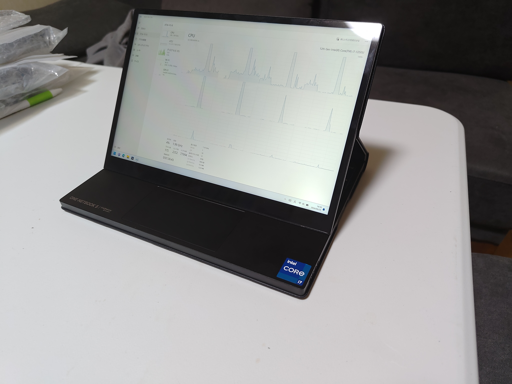
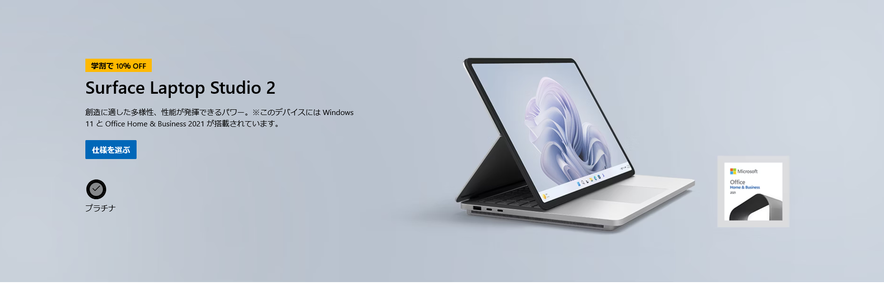
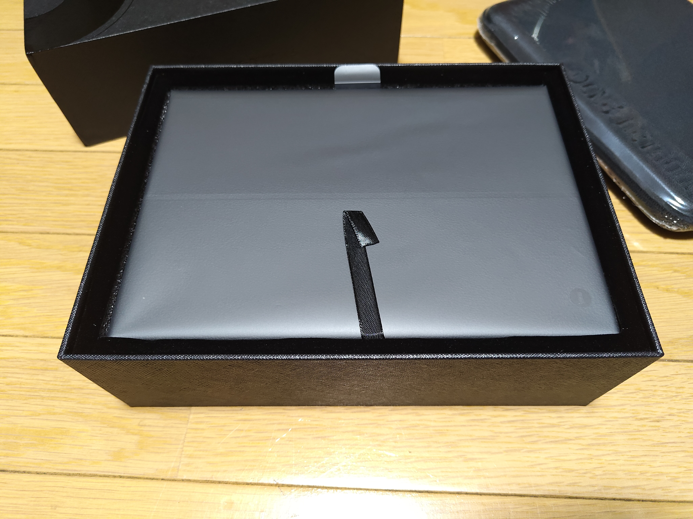
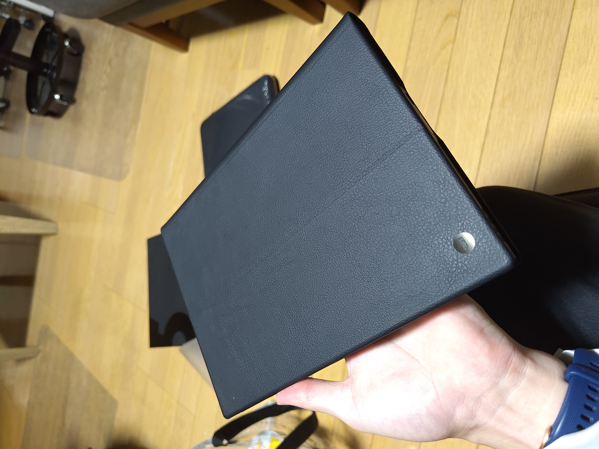
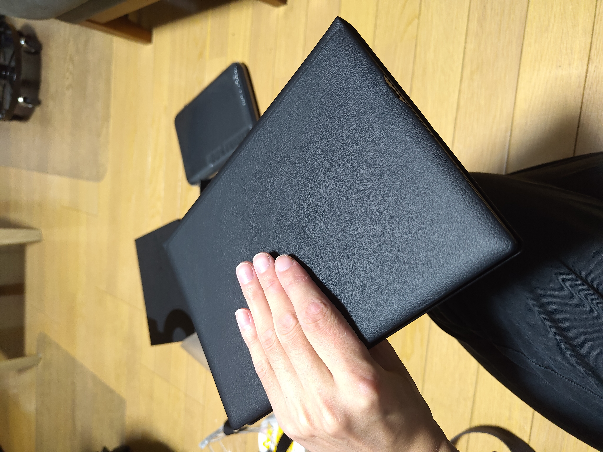
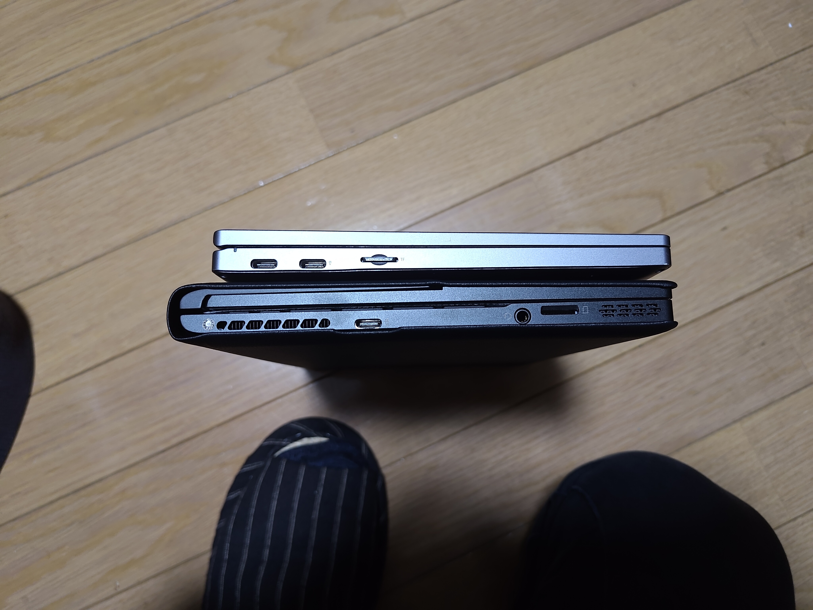
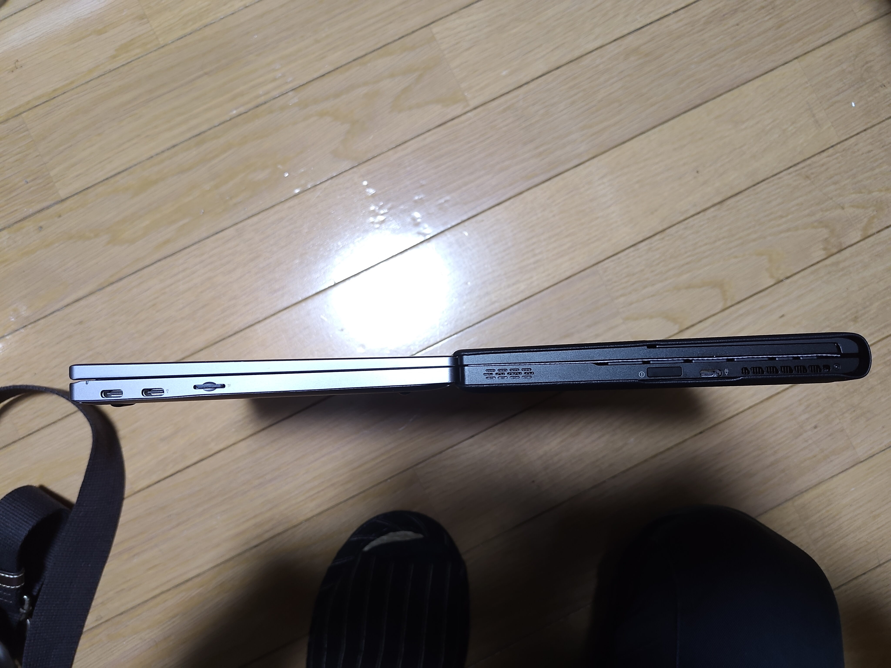
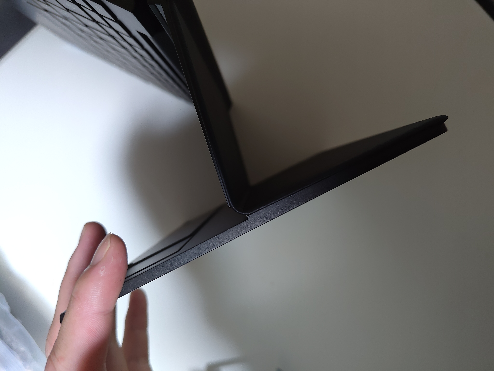
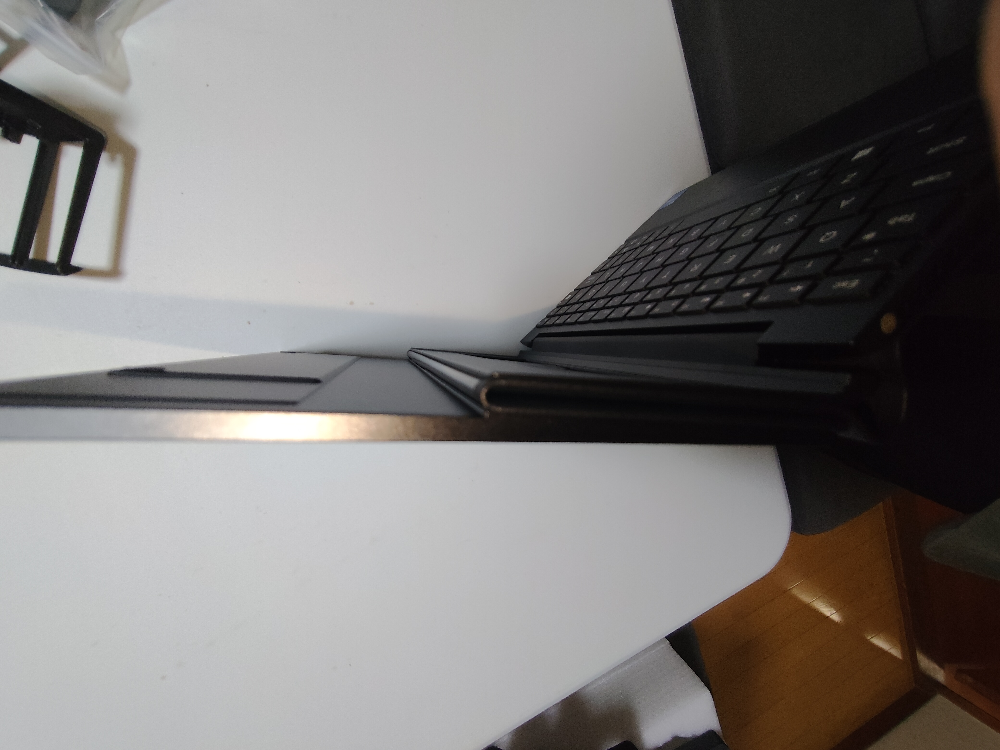
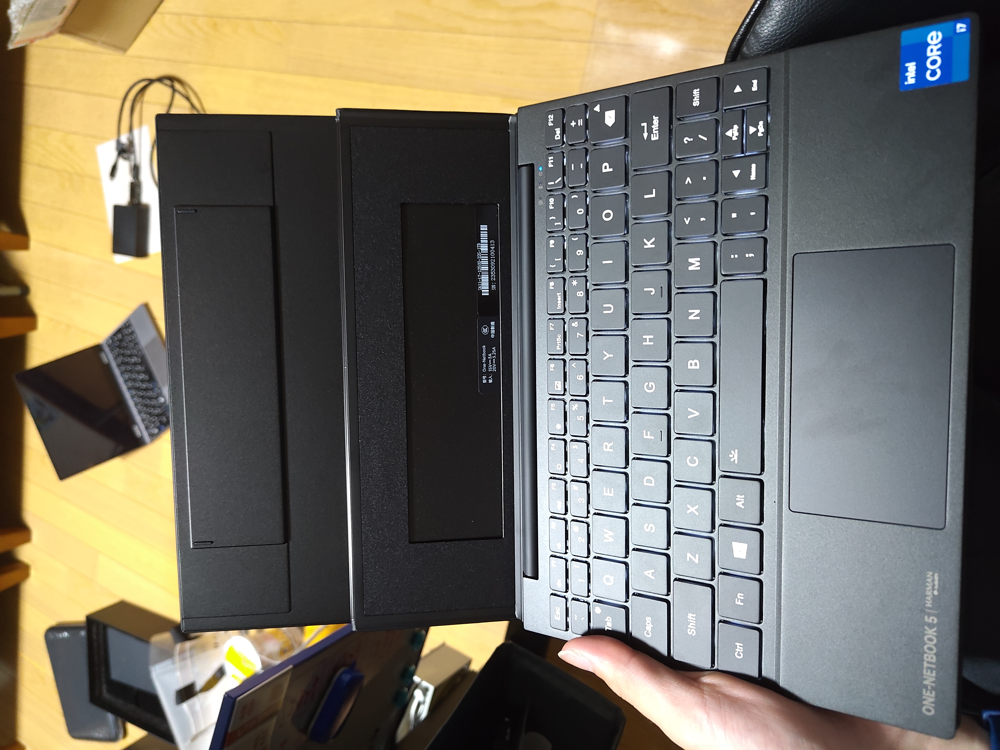

どうもharukinです。

ちょっと前からOneMix5を使っておりある程度の使用感が纏まったら書こうと思っていたので書いていこうと思います。

## 1. OneMix5とは

[このPCWatchの記事](https://pc.watch.impress.co.jp/docs/column/nishikawa/1554444.html)が参考になると思うので見てくださいな。
簡単に言うと、ディスプレイ部分が変形する小さいノートパソコン兼タブレットです。

その挙動とスタイルは、Surface Laptop Studio に近いものがあります。

元々手元にはOneMix4があるのですが、色々と通常使用には差支えがある状態になってきたので、この変形機構に興味を持ち購入しました。

:::tip
今回登場するOneMix5は、AliexpressのOne-netbook公式から購入した英字配列のものです。英字配列に関しても記述しますが、日本で発売されているtech-oneのOneMix5は日本語配列しかありませんので注意が必要です。
:::

## 2. スペック表：

| 項目             | スペック                                                                |
| ---------------- | ----------------------------------------------------------------------- |
| CPU              | Intel Core i7-1250U                                                     |
| RAM              | 32GB LPDDR5                                                             |
| ストレージ       | 1TB PCIe4.0*4 NVMeSSD                                                   |
| ディスプレイ     | 10.1インチ 2560x1600 16:10 10点マルチタッチ対応                         |
| インターフェース | TypeC(USB3.2 x1, USB4 x1), 3.5mmイヤホンジャック, microSDカードスロット |
| 通信             | Wi-Fi 6E, Bluetooth 5.2                                                 |
| バッテリー       | 11000mAh                                                                |
| 充電             | 最大65W TypeC                                                           |
| サイズ           | 232 × 167 × 15mm                                                        |
| OS               | Windows 11 Pro                                                          |
| 重量             | 979g                                                                    |
| 価格             | 198000円(日本公式販路)                                                  |
| 購入価格         | 148000円(aliのセールとか色々)                                           |

## 3. 開封と外観
生活感丸出しstyleごめんね

いつもの蟻の箱から出てくるのが本体。今回はケースも付属していた。

流石に中国直送なので角が潰れてたりするけど、箱の質感は割としっかりしてて上品。

おおー、引っ張って取り出す系の奴ね。
|                              |                              |
| ---------------------------- | ---------------------------- |
|  |  |
皮に包囲されている...  

[画像]

天面の左上にはおとなしそうな①のマーク。

> [!TIP]
> [天一段ボールの画像]
> 
> ~段ボールを部屋に置いていたらこの１のマークを見て天下一品じゃんwwって煽られた~

| 高さ                         | 幅                           | 厚さ                         |
| ---------------------------- | ---------------------------- | ---------------------------- |
|  |  |  |

OneMix4とのサイズ感を比較。高さはハッキリ大きくなっていて、幅はほぼ誤差、厚みは**皮の分分厚くなっているな**という感じ。

### じゃぁ、なんで皮なんかつけたの？
当然そんな疑問になるとは思いますよね・・・・

この皮という物体が実は変態機構に大きくかかわってきているのです・・・

まず、この二枚の画像を見てもらいましょう。
|                              |                              |
| ---------------------------- | ---------------------------- |
|  |  |

わかるかな？これで察した人は賢いですね。私はこれを見たとき一瞬フリーズしましたよ・・・

わからない人のためにlottie作りました。**赤はディスプレイ、茶色は皮です。**
<iframe src="https://cdn.lottielab.com/l/2sf9VifmzZ6RwK.html" width="494" height="329" frameborder="0"></iframe>

ならその真ん中の黄色はなんだって？

### ・・・・液晶のフレキケーブルなんですよこれ！！！！！！！！

数年経ってるとはいえ、所詮中国の小さなメーカーです。どういった機構でこのヒンジを作成しているのかと思っていました。VAIOやSurface Laptop Studioはそれはまたしっかりした金属ヒンジを作成してきました。中華でそんなものが作れるのかと。どうやって再現しているのか、まぁ商品自体はそう動いているのは分かっているので虚偽ではないんだろうがはてさて...とは思っていましたが。

### ヒンジが無いって！！！皮で緩ーく丸くしてるだけってどういうことなんだよ！！！！

この**皮の柔軟性**に全てを期待する発想の柔軟さ、恐れ入りました。これがOne-netbookの発想力か・・・

確かにフラットなケーブルだよ？フレキシブルなケーブルかもしれないけどさ・・・**それに全てを期待する設計するかね普通wwwww**すげぇよOne-netbook。恐れ入りました。思想が強烈。確かにこれだったら超低コストに変態機構を作成できる。

ということで、ヒンジは無く、ディスプレイは言ったら常に空中に浮遊している状態を面磁石で必要箇所に固定するっていうストロングスタイルなんです。だから、固定しない状態にするとぷらぷらと揺れる。そりゃぁそうだ。固定する要素が全くないんだから。**このヒンジと言うには心もとなさすぎる機構、耐久性は大丈夫なの～？？？**

一応、ノートパソコン形態の時に張り付く場所にはハマるように磁石が配置されており、ノートパソコン形態になるときはそこにピッタリハマって正しい皮の負荷状態になるらしいんですよね。ただ、こういう配慮が効かないのがタブレットモード。

[タブレットモードの画像]
うーん、これ、ケーブルどんぐらいの折り曲げ耐久あるんだろう...wちょっと寿命厳しそうな気が...w

