どうもharukinです。

ちょっと前からOneMix5を使っておりある程度の使用感が纏まったら書こうと思っていたので書いていこうと思います。

## 1. OneMix5とは

[このPCWatchの記事](https://pc.watch.impress.co.jp/docs/column/nishikawa/1554444.html)が参考になると思うので見てくださいな。
簡単に言うと、ディスプレイ部分が変形する小さいノートパソコン兼タブレットです。

その挙動とスタイルは、Surface Laptop Studio に近いものがあります。

元々手元にはOneMix4があるのですが、色々と通常使用には差支えがある状態になってきたので、この変形機構に興味を持ち購入しました。

:::tip
今回登場するOneMix5は、AliexpressのOne-netbook公式から購入した英字配列のものです。英字配列に関しても記述しますが、日本で発売されているtech-oneのOneMix5は日本語配列しかありませんので注意が必要です。また、一応性能が良い、悪いなどの話はしますが私自身は **自分のユースケースで体感で良くなっているか** が重要で、それほどスペックとかベンチマークの数字とかに興味が無いため取り上げません。予めご了承ください。
:::

## 2. スペック表：

| 項目             | スペック                                                                |
| ---------------- | ----------------------------------------------------------------------- |
| CPU              | Intel Core i7-1250U                                                     |
| RAM              | 32GB LPDDR5                                                             |
| ストレージ       | 1TB PCIe4.0*4 NVMeSSD                                                   |
| ディスプレイ     | 10.1インチ 2560x1600 16:10 10点マルチタッチ対応                         |
| インターフェース | TypeC(USB3.2 x1, USB4 x1), 3.5mmイヤホンジャック, microSDカードスロット |
| 通信             | Wi-Fi 6E, Bluetooth 5.2                                                 |
| バッテリー       | 11000mAh                                                                |
| 充電             | 最大65W TypeC                                                           |
| サイズ           | 232 × 167 × 15mm                                                        |
| OS               | Windows 11 Pro                                                          |
| 重量             | 979g                                                                    |
| 価格             | 198000円(日本公式販路)                                                  |
| 購入価格         | 148000円(aliのセールとか色々)                                           |

## 3. 開封と外観
生活感丸出しstyleごめんね

### 箱とか表面の素材とか

いつもの蟻の箱から出てくるのが本体。今回はケースも付属していた。

流石に中国直送なので角が潰れてたりするけど、箱の質感は割としっかりしてて上品。

おおー、引っ張って取り出す系の奴ね。
|                              |                              |
| ---------------------------- | ---------------------------- |
|  |  |
皮に包囲されている...  

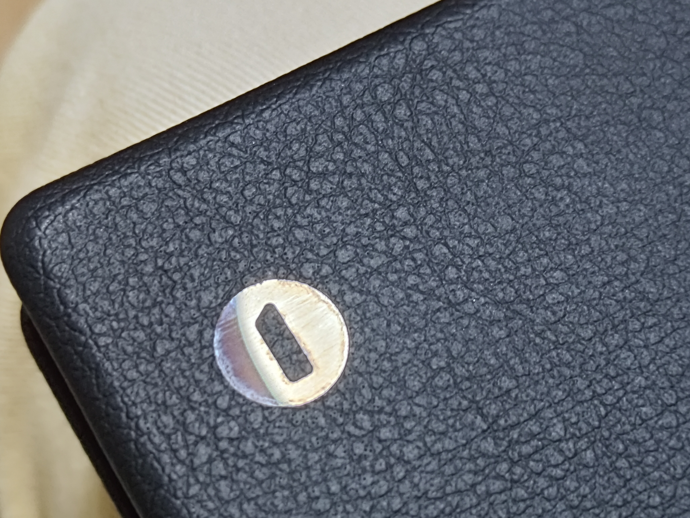

天面の左上にはおとなしそうな①のマーク。

> [!TIP]
> 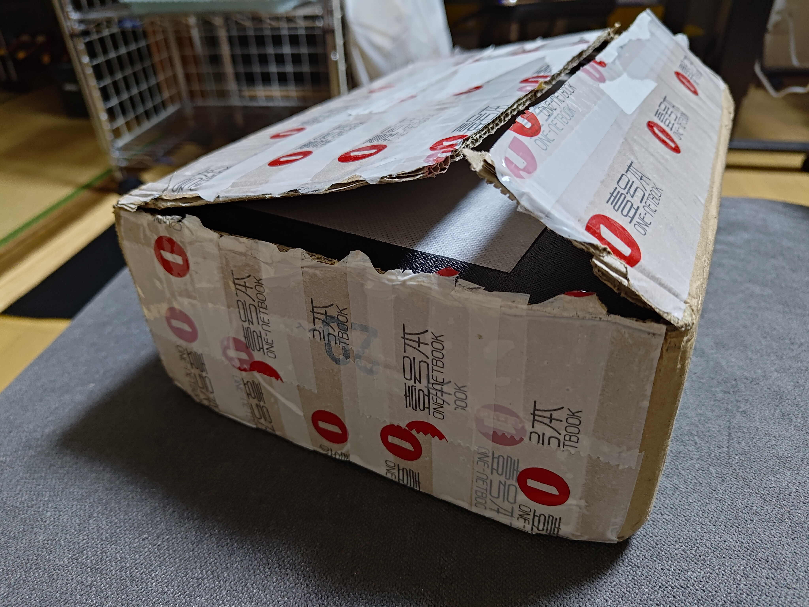
> 
> ~段ボールを部屋に置いていたらこの１のマークを見て天下一品じゃんwwって煽られた~

### 各部の配置

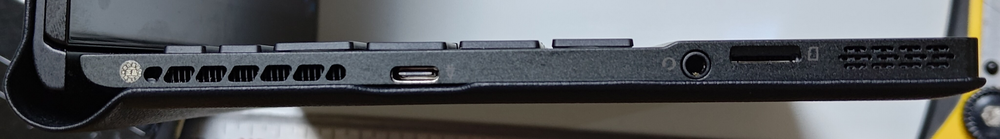
まず左側面、奥側から排気口(？)とtypeC端子、イヤホンジャック、microSDカードスロット、スピーカー

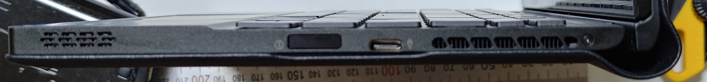
そして右側面、奥側から排気口(?)とtypeC端子、指紋認証付き電源ボタン、スピーカー

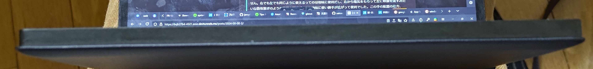
そして前面には特に無し

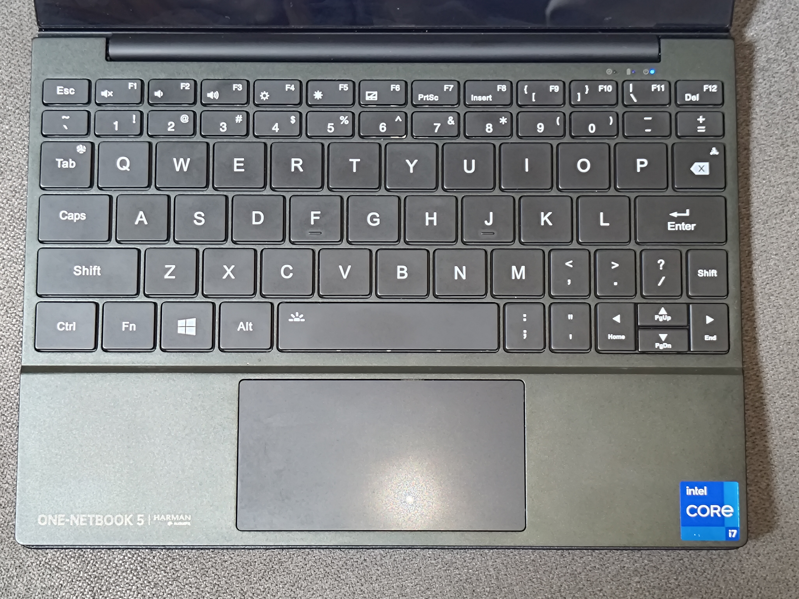
スタンダード(?)なキーボード。今回は英字配列を購入したので、日本語配列とは違う配置になっている。流石に上部の数字エリアやFnキー、PやLの右側が下に押しやられてたり少ししんどい場面はあるかもしれないが、OneMix4でもそうだったし右手の小指でEnterが楽に打てるのが地味に便利だったりもする。キーピッチ自体は標準的なキーボードに近く、アルファベットだけ打っている分には他のキーボードと大差ないうち心地で、日本語配列よりは崩れてるポイントが少ないので非常に扱いやすい。
左下にはONE-NETBOOKのロゴとHarman Audio FXのロゴが入っている。

因みに日本語配列を下に貼っておく(OneMix4のものですが、OneMix5もほぼ同じ配置)
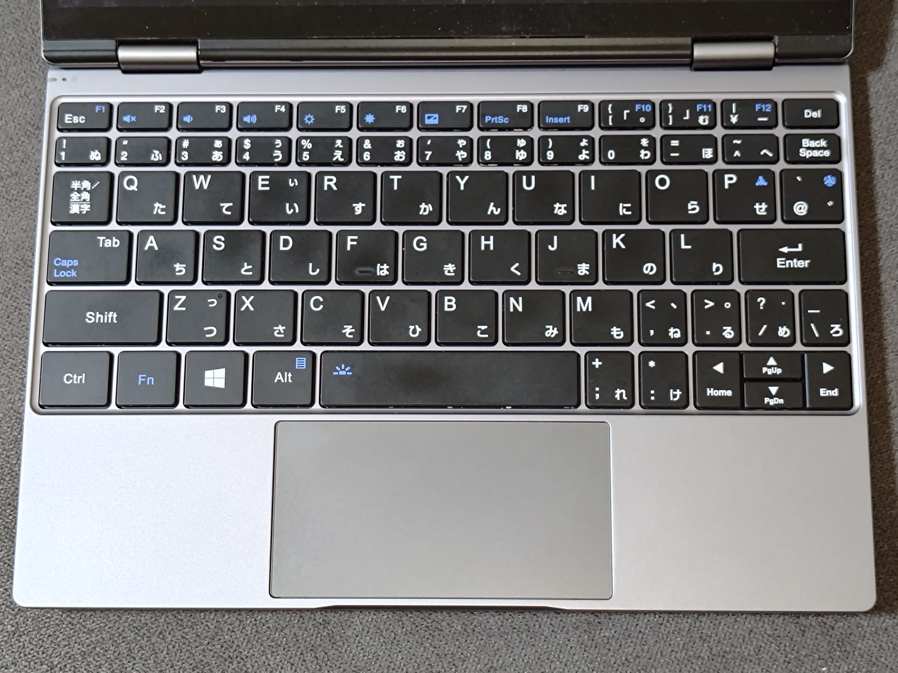

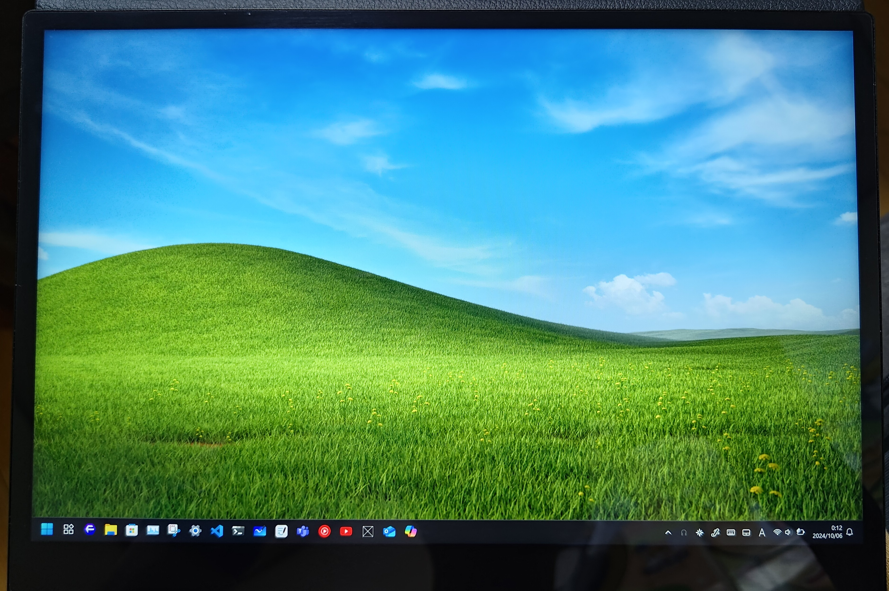
OneMix5のディスプレイはOneMix4と大差ない10.1インチのもの。解像度は2560x1600で変化なし。ディスプレイの質感はOneMix4と変わらず、光沢が強い。ただ、ディスプレイの角度が全く開かずノートパソコン形態で使うときに目線から角度が直角にできないので少々見づらいことになってしまう。

「？」については、後述しますね。

> [!TIP]
> 一応、公式の記述的には右のCと左のCは性能差があるようなので場合によっては使い分けが必要かもしれないものの、両方とも同等性能のPD入力、DP-altモードを搭載しているため自分の使用レベルでは差がありません。右でも左でも同じように使えるってのは地味に便利だし、右から電気をもらって左に映像を流すみたいな数珠繋ぎのような配置も可能だったり地味に使い勝手が広がって便利でした。この手の配置の仕方、もっと流行ってもいいと思う！

### OneMix4とのユルイ比較

| 高さ                         | 幅                           | 厚さ                         |
| ---------------------------- | ---------------------------- | ---------------------------- |
|  |  |  |

OneMix4とのサイズ感を比較。高さはハッキリ大きくなっていて、幅はほぼ誤差、厚みは**皮の分分厚くなっているな**という感じ。

####  じゃぁ、なんで皮なんかつけたの？
当然そんな疑問になるとは思いますよね・・・・

この皮という物体が実は変態機構に大きくかかわってきているのです・・・

まず、この二枚の画像を見てもらいましょう。
|                              |                              |
| ---------------------------- | ---------------------------- |
|  |  |

わかるかな？これで察した人は賢いですね。私はこれを見たとき一瞬フリーズしましたよ・・・

わからない人のためにlottie作りました。**赤はディスプレイ、茶色は皮です。**
<iframe src="https://cdn.lottielab.com/l/2sf9VifmzZ6RwK.html" width="494" height="329" frameborder="0"></iframe>

ならその真ん中の黄色はなんだって？

#### ・・・・液晶のフレキケーブルなんですよこれ！！！！！！！！

数年経ってるとはいえ、所詮中国の小さなメーカーです。どういった機構でこのヒンジを作成しているのかと思っていました。VAIOやSurface Laptop Studioはそれはまたしっかりした金属ヒンジを作成してきました。中華でそんなものが作れるのかと。どうやって再現しているのか、まぁ商品自体はそう動いているのは分かっているので虚偽ではないんだろうがはてさて...とは思っていましたが。

#### ヒンジが無いって！！！皮で緩ーく丸くしてるだけってどういうことなんだよ！！！！

この**皮の柔軟性**に全てを期待する発想の柔軟さ、恐れ入りました。これがOne-netbookの発想力か・・・

確かにフラットなケーブルだよ？フレキシブルなケーブルかもしれないけどさ・・・**それに全てを期待する設計するかね普通wwwww**すげぇよOne-netbook。恐れ入りました。思想が強烈。確かにこれだったら超低コストに変態機構を作成できますね。

ということで、ヒンジは無く、ディスプレイは言ったら常に空中に浮遊している状態を面磁石で必要箇所に固定するっていうストロングスタイルなんです。だから、固定しない状態にするとぷらぷらと揺れる。そりゃぁそうだ。固定する要素が全くないんだから。**このヒンジと言うには心もとなさすぎる機構、耐久性は大丈夫なの～？？？**

一応、ノートパソコン形態の時に張り付く場所にはハマるように磁石が配置されており、ノートパソコン形態になるときはそこにピッタリハマって正しい皮の負荷状態になるらしいんですよね。ただ、こういう配慮が効かないのがタブレットモード。

.jpg)
うーん、これ、ケーブルどんぐらいの折り曲げ耐久あるんだろう...wちょっと寿命厳しそうな気が...w

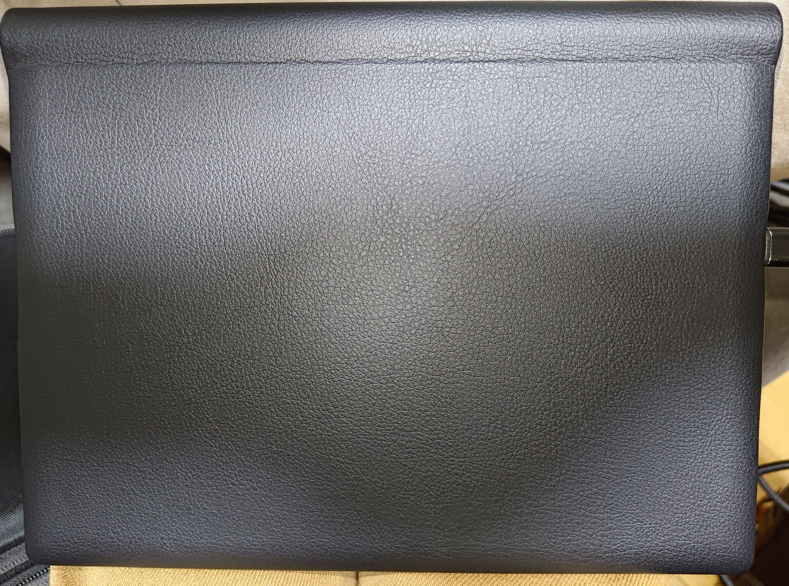
OneMix4の頃は底面に吸気口があったのですが、OneMix5では革巻きの都合上排気口が無い。オフトゥンに入って使っても毛を巻き込まなくてもいいね！(よくねぇよ)

底面に吸気口が無いため、恐らくヒンジ部やキーボード面から吸気していると思われます。排気は側面。

## 4. OneMix5の個人的な良かったところ紹介

1. 小型こそ正義
   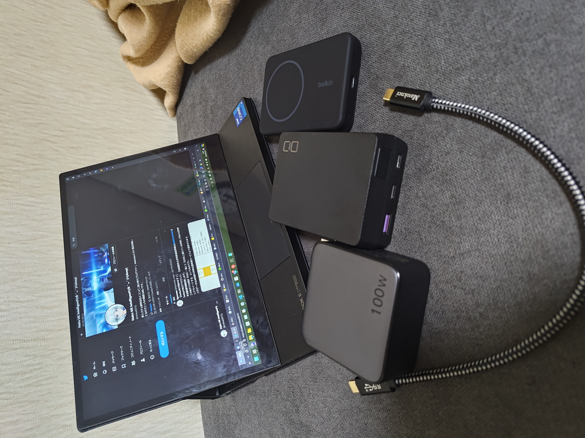
   やはり！！小さいは正義！！10インチで十二分な性能を持っているので、持ち運びも楽々。OneMix4と比べても大きさはほぼ変わらないので、持ち運びには特に問題なし。いつでもどこでもサクッと展開して作業が可能なので滅茶苦茶便利に使ってます。13インチとかだとちょっと取り回しを考えちゃいます。
2. 無難に増強された性能
   
   一応、OneMix4からのスペックアップはしている。特にRAMが32GBに増強されたのは大きい。OneMix4は16GBだったので、それに比べるとかなり快適になった。CPUはi7-1160G7からi7-1250Uに変わったので、PコアEコアで電池持ちは改善している。OneMix4でCPU性能はある程度足りていたもののRAMが足りなくなりがちだったので32GBになっているのも機種編の理由の一つにはなる。あと、OneMix4の電池が限界を迎えていたのと謎の性能抑制動作がありまともに使えないバグが発生していたのだが、それも再現はしなくなっていたので現状の体感は大きく改善されている。

ここまではまぁ、スペックシートでもわかる良かったところだが、スペックシート以外の、この機種特有の良かった部分を紹介していこう。

3. 左右に配置されたフルスペックtypeC
   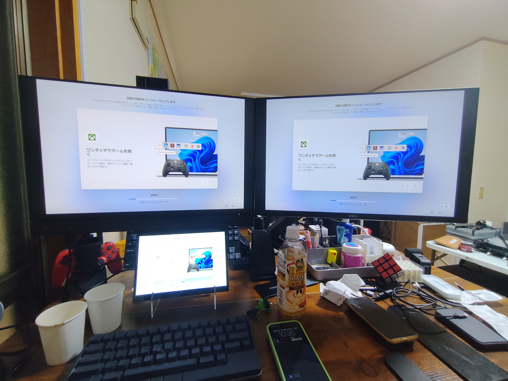
   外観の項目でも言いましたが、地味に左右にフルスペックのtypeCポートがあるのってイメージ無い。やはり右からも左からも充電したいときはあるんでこの配置は普通に助かるし、何ならデスクトップとしてtypeC-altで出力するときも右か左か気にしなくてもOK、この取り回しの良さはOneMix4の時には無くて、地味に感動してます。膝の上に置いて使うとき、どっちにバッグを置いてるかなんてその時に寄りますし、最短距離でケーブルを接続できるならそれに越したことは無いです。地味に快適。

4. キーボードの打ち心地
   
   OneMix4の頃からそうなんですが、割とキーボードもしっかり深さがあって外で使う分には気にならない。少なくとも、ちゃんと物理的に動いているのでいつかのMacのペチペチキーボードのような指を破壊しそうな感じはないです。普通にキーボードとして打てる。そして、気になるのがやはり配置なんですが、これもまた癖に慣れたら便利だったりもするんです。
   
   地味に左右が狭いのって、問題でもあり利点でもあるんです。カッコ系のキーが右上に、;:.,<>などの記号系が下に押し込まれているのでそこは正直使いにくい。ノールックは無理かなぁ...でも、その分EnterキーとBackSpaceが小指で楽々打てる位置に来たのでそれは便利だったりもします。因みに、CapsLockは全角半角に変更しておきました。~一番要らねぇし一等地にあるしw~そのおかげで、言語変更も左の小指でサクサクできて、指の移動コストがとても少なくて済むんでめっちゃ便利です。こういうの、HHKBと近しいものがある気がしますね。私は嫌いじゃないです。これを普段使って大きめのノートパソコンとか触ると、手を動かさないといけなくてまどろっこしく感じちゃうんですよね...

5. 謎に音がいい
   
   Harman 監修なサウンド、正直馬鹿にしてましたが想像以上にいいんですこれ。勿論、デスクトップで使うようなしっかりした音響には全然叶わないんですがノートパソコンとしては普通にハイレベルに仕上がってると思います。OneMix4の時は本当に酷い音だったのですが圧倒的に「ちゃんとメディアプレーヤーとして通用する」。自分は音にそこまで詳しくないのでそういう指標は持ってないんですが、スピーカーが手前にあることもあってか、かなり音の広がりがいいんですよね。

   ↓Twitterでアップした動画、スマホで適当に録画しただけでも異常に音質が向上していることがわかります。
   <blockquote class="twitter-tweet" data-media-max-width="560">
ブログ用動画/OneMix5とOneMix4の比較してはならない圧倒的音質差動画。 マジでこの音響の変化は凄まじく、一気にメディアマシンとして使うことが増えた。 <a href="https://t.co/QNwVwlvDV6">pic.twitter.com/QNwVwlvDV6</a>
&mdash; Hairs UK Intelligent٩(✿ &#39; ᴗ &#39; )۶ (@mhkai00731) <a href="https://twitter.com/mhkai00731/status/1842847069654139051?ref_src=twsrc%5Etfw">October 6, 2024</a></blockquote>  

   本当にこれ、どうしたのってぐらい音がちゃんとしてるんですよ。どうしちゃったんだ？高音とか低音とかそういうパラメーター的なものじゃなく、根本的に音がちゃんと出てくるんですよね。Prime Videoとかで映画見る時にもちょうどいい。下手なスマホより全然使える。いや、こんないい？これまでのノートパソコンでトップクラスに音がいいです。もう、手放しで褒めちゃえるぐらいに。

6. 電池持ちがかなり良くなっている
   
   手元のOneMix4が勿論バッテリーがかなり劣化していた、ということもあるんだけれどもちゃんと平均4-5時間、音楽流しながらブラウジング、開発作業が快適にできるぐらいの電池もちがあります。これぐらいあれば、バックアップのモバイルバッテリー(CIO/20000mAh)を持って行ってるんで大体一日の作業はカバーできるかな。でもまぁ少ないって反応はありそう。

7. ひっくり返せるディスプレイの可能性
   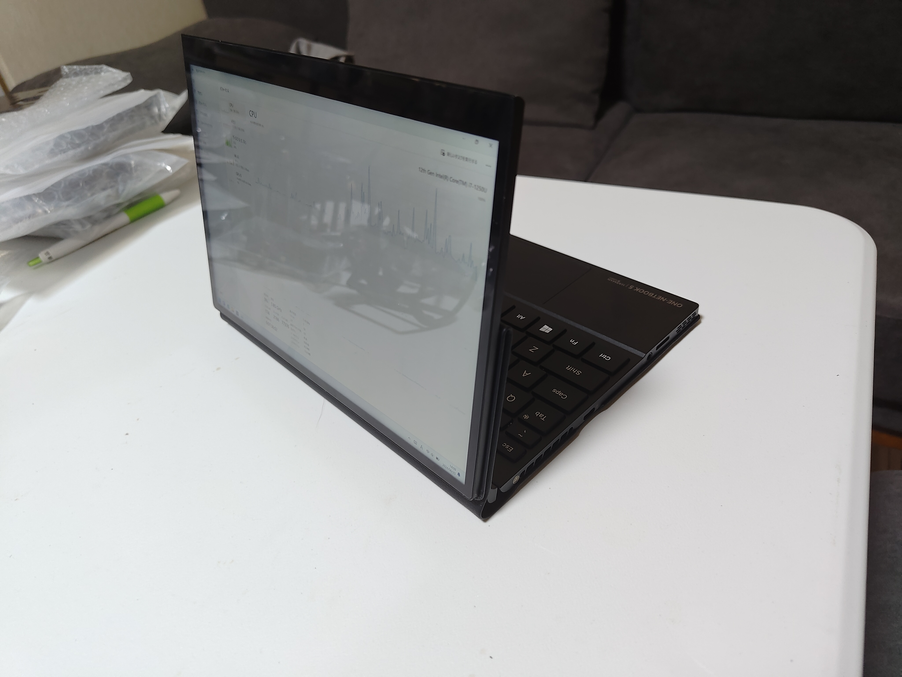
   話し合いしているときに情報をサクッと見せたいと思ったときにディスプレイをひっくり返して相手側にすることができるんですよ。機構からすると当たり前じゃないかって話ではあるんですが、割と対面で話しているケースが多いのでパソコンをひっくり返したりしなくてもそのまま、席を立つこともなく情報を見せることができて地味に使うことが多いんですよ...全くこれの用途は考えてなかったものの、割と出現確立が高いシーンになってます。

8. 他のモードの可能性
   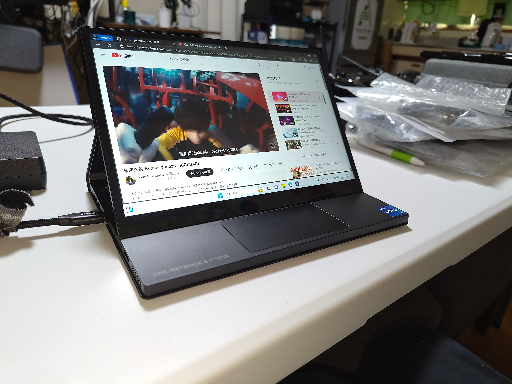
   スピーカーが手元側にあるのも効いてるんですが、このパターンで再生するメディアがものすごくしっくりきて良いんですよね。机に設置してダラダラ見るのちょうどいい。割と使用頻度高いです。

   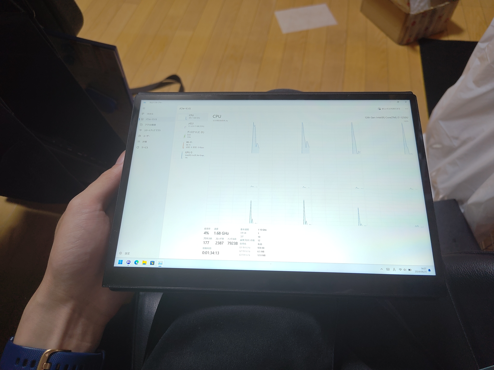
   OneMix4では360度回転でタブレットモードは作れたんですが、なんというかキーボード面が裏に来るのがちょっと嫌でなんだかんだあまり使うことなかったんですけど、OneMix5だとタブレットモードの裏はキーボード面にならないので手持ちしても安定していて、微妙な角度もあってペン入力がしやすいんですよね。これを使いだしてからちょっとはペンも使ってみるか～って写真の加工とかに使う機会が増えました。割と悪くない。すごく地味なんだけど、このキーボードが裏にあるって状況、そこそこ個人的にストレスなんだなって感じました。

このように、OneMix5はOneMix4からのスペックアップだけでなく、機種独自の良かったところが多くあります。個人的に一番効いてるのは音質の強化なんですが、変形ユニットも割と使うときが多くてかなり値段だけの価値はあるのかなぁ、といった感想を持っています。

## 5. OneMix5の個人的な悪かったところ紹介
まずは上と並べてスペックシートからの悪かったところを紹介していきます。
1. 重さ、大きさ、分厚さ、全部増加
   
   OneMix4からあらゆる部分で微妙にサイズアップしていてまた少し、UMPCからは離れてしまいました。とはいえまだ僅かで、個人的には許容してやってもいいか、というぐらいではあります。でも、どう見ても、皮が無ければ相応に軽く、同等の厚さに留まったはずなのでこの皮のためのこの変化はちょっとなぁ～、と思います。

2. この時代に第十二世代？？
   
   元々この商品が公式に発表されたのは、2023年の夏でした。でも、この時期に既に第十三世代のIntel Core iシリーズが発表されていたので、「え～～～～今更～～～～？？？？」っていう気持ちは大きかったです。そりゃぁ困らないだろうけど...君安くないんだよ？？？そんでなんだかんだ発売はずれ込んでほぼ2023年末に出荷が開始されて、非常に「タイミングおかしいだろ」と思いました。そんで私が買った頃にはもう第十四世代(と言うべきでもない、Core Ultraなどの新世代)が発売されまくってるわけです。勿論、One-Netbookもこれに漏れず、OneXPlayerシリーズで積極的にこれらの最新CPUを積んだ機種を投入しまくってます。その中で、OneMix5は第十二世代のi7-1250Uを搭載しているので、この時期にこのCPUはちょっとなぁって思っちゃいますよやっぱり。もうちょっと早く出してくれてたらなぁ～って思います。もしOneMix4sを買っていたら、性能は変わらないわけで、絶対にOneMix5を買っていないと思います。性能上がらないからね。でもまぁ、OneMix4からなら性能上がってるしいいかぁ、って思って購入に至った経緯もあります。実際、この二者の性能差、省電力性能は割とあるっぽくて満足はしています。

んじゃ、肝心なスペックシート以外の、この機種特有の悪かった部分を紹介していこう。

3. ヒンジの角度が小さすぎる！！
   
   [画像]
   OneMix4だと、画面が小さいのもあって、画面が360度開くヒンジだったので開いて膝の上に置いたとき、画面の角度を180度近くガッツリ開いて上からのぞき込むような感じになっていたんですよね。なんですけどこのOneMix5、ヒンジがめっちゃ開かなくて大体120-130度ぐらいで止まっちゃう。しかも、後に暇を持て余した皮があって更にリフトアップしてきます。これが...かなりの問題なんです。これのせいで、膝の上に置いたときに画面への目線が垂直にならない。見える画面がちょっと台形になっちゃう。これ、もっと開かなかったかなぁ...凄い勿体ないと思う。どうしてこんな開かないヒンジにしたんだよ...
   .png)
   とは言いますが、実際の角度的にはVAIOの一部シリーズと大差ないようです。しかし、画面サイズが小さいため、特に目線が全体的に下に行く必要があるためどうしてもそういった感想を抱くことになるんだと思います。まぁ、全体的に下側に圧縮されるわけですからね。でも目線的にめっちゃ台形な画面を見ることになったのが、OneMix4からの引っ越しではまぁまぁなストレスになりました。もう慣れましたけどね。また、それと関連した一件の問題。

4. 皮のリフトアップ機構、存在としてどうなん？？
   .jpg)
   ノートパソコンモードにしたとき、このヒンジの部分の皮が贅肉のようにたわんで全体的に下側を押し上げるようになっているんです。ただリフトアップするんならまだしも、これ皮なんですよね。そんなVAIOみたいなしっかりした支えがあるわけじゃない。押したら平気で皮が動くし、ノートパソコンの「脚」として存在するには心もとなさすぎます。廃熱口でも開けたかったのかな...そんな中途半端なフニャフニャリフトアップ機構、要らないんですけど...これは百害あって一利なしですよ。う～～ん。

5. ペンタブのような筆記の確実性は無い
   
   正直ペンタブを持ってないので比較対象も無いのがアレですが、明らかにホバリングしたときに芯がブレている。あくまでもこのペンは情報の加筆などに使う用で、本格的にお絵描きをしたいような需要を満たすものではないです。正直、値段がそこそこするんだからそれだけのディスプレイは搭載してくれとも思うのですが...(ただ、これに関してはペンがOneMix4の時のモノを流用しているためもっと上位なペンを買って試してみる価値はあるかもしれませんね)

6. 電池もちはお世辞にも良いとは言えない、発熱も多い

   まぁこの手の商品には当然なのですが、所詮IntelのCPU積んで小型で排熱範囲も小さければ電池残量も限られるマシンで電池もちが素晴らしいなんてレビューは与えれませんよね。どう考えても。こっちは腐ってもCore i7なんで、性能重視、発熱多めです。まぁOneMix4よりはマシになったのは事実で、皮のおかげもあって手に触れる範囲で熱くて触れないっていう反応はしなくて済むんですが、それって熱を溜め込んでいるようなもんですから個人的には減点対象になりますね。逆に言えば、そういうのを抑えたのがN100なわけですからChuwiのMinibookXとかが同サイズ感でN100で出ているのでそっちの方が本来の用途にはあっているんじゃないかな、とも思います。そもそもとして、この手のマシンでcore i7が必要な作業をさせるんじゃねぇよ、って話ではありますが残念ながらそう聞き分けのいい筆者ではないんですよね。それはそれとしてもN100やN95のUMPCも触ってみたいなぁ。

7. 価格が高い
   
   結局最終的にはここに行きつきますよねwww価格が高ければいつになっても買えません。今回も、Aliexpressがセールで偶然15万切りが可能だということがわかったから踏み切ったんであって、普通の金額ではちょっと買おうとは思いません。ていうか、この値段出したらもっと圧倒的な高スペックのノートパソコン買えるじゃん。コスパで見るべき商品じゃないのは事実だけど、やっぱり気にしてしまいますよねぇ。個人的には、corei5版を出してくれてもええんやで、とは思いました。でも本国も日本もi5版の仕様が出てこないのでプレミアムハイエンド的地位を築きたいんでしょうね...いや、君それだけのビルドクオリティ出せてないでしょ？そこからだよ？

## 6. まとめ
色々な要素について語ってきましたが、そもそもこれを他人におすすめするかと言ったら **全くおススメしません。** コスパが見合わないのもそうですし、機構に不安点がありすぎます。いくら保証があったとしてもちょっと不安なポイントは多いですね。でも、それはそれとしても、 **この変形システムとこの音質は買うだけの価値があった** とは言えます。これだけに金を出してもいい！小さくてこれだけできてて完璧！！っていう変人の皆様なら、買ってもいいかもしれません。実際、似た機構を持つSurface Laptop Studioはこんな金額では買えないですし...それを考えれば無しではないのかな...でも、マジで電池持ちをなんとかしてしまえばどこでも運用出来て音楽も映画も開発も完璧にこなせる最強マシンなのは事実なので、**個人的にはマジで買ってよかったと思いますしこれからも第一線で活躍してもらおうと思います。**

