どうもharukinです。どうしても気になって、買ってしまったんですよね。HHKB Studio。

元々はHHKBというハードそのもの、配列、コンパクトさ、あらゆる面から非常に気になってはいました。ただその配列が適応できるか、価格的に挑戦しづらくずっと様子見をしていたんですよね。このHHKB Studioが登場するまでは....

# HHKB Studio というキワモノ中のキワモノ

HHKB Studioに惹かれた要素、それは言うまでもなく...いや、ほぼ全部なので一つ一つ言っていきましょう。
触った感触としては次の三点は重点的に見ていきます。

## 1. HHKBのデフォルトのキー配列

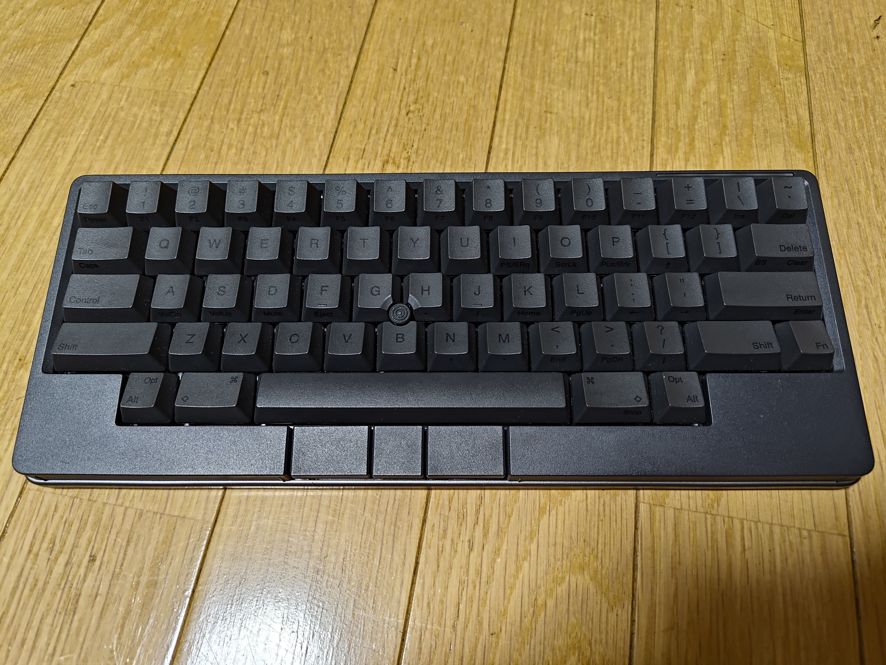
ずっとこれは気になってはいた。このような謎の超独自な配列が何故これまでの人気を誇っているのだろうか。慣れてしまえば間違いなく最高の環境があるのだろう...と...

## 2. 中央に鎮座するトラックポイント

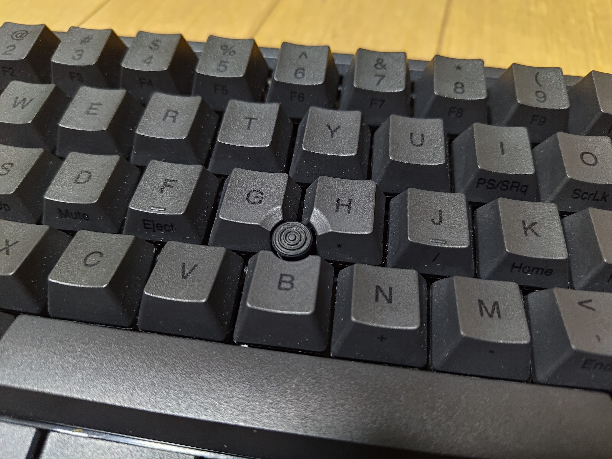
以前からHPのモバイルワークステーションを触ってある程度の感触は理解していたので、あったら便利なことはわかっていた。 **マウスに手を動かす必要が無いんだぞ、最高に決まってるよなぁ？**

と、言うのは簡単ですが実際にそれを常用したことはなかったのです。これもまた、Thinkpadでカルト的な人気を誇っている。ちゃんと、使ってみたいよな...

## 3. 何かに目覚めそうなサイドジェスチャー

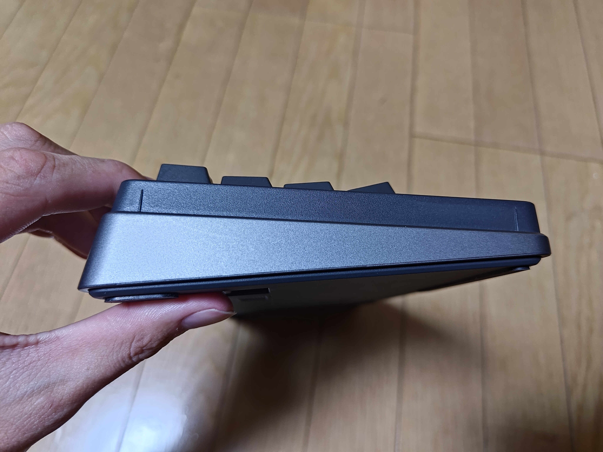
何かは全く分かりませんが、何か使えそうじゃないですか。このジェスチャー。なんかこれ使えそうじゃん。なんなんだろう。すごいムズムズするんだよな。痒い所に手が届きそうな。

## HHKB Studioのための独自の軸 #とは

HHKBと言えば、静電容量無接点。そう言われていましたがなぜかHHKB Studioではそれを排除した。とはいえ、私はその静電容量無接点もまともに触ってないので比較対象にはなりません。ただ、ホットスワップが可能という情報は聞いていたので、あとからあとから壊れても交換可能、なんなら互換性のある軸に交換可能というポイントに惹かれました。買ってもきっと、無駄にはならない。因みに、私は中華青軸を使っていたぐらいでそれほどキーボードオタクというわけではありません。ゲーマーでもないですしプログラミングや事務処理が主なのでカチャカチャうるさいのはもう懲り懲りでした()

# 開封とか初期設定とか

開封だショートカットキーだセットアップだといった共通する話題は他者の記事を見てくださいな。公式にも切り替え機能が紹介されているのでスキップ！

# 数か月触って決まった特殊キーの設定公開

HHKBはそのカスタマイズ性もウリ。実際に使っていくうちに少々手が届かない部分があったので各種設定を変更していったので紹介します。

下部に用意されたマウスの右左のクリック用のキー、その真ん中に置かれたキー、中クリックとかと思っていたんですがFn2らしく機能切り替えのためになっているんですね。これを押しながら別のアクションを割り当てられると...こんなところに配置されたら微妙に欲しかった機能割り当てられちゃいますよね。

#### キーボードの設定

| 通常時                  | Fn1                 | Fn2                     |
| ----------------------- | ------------------- | ----------------------- |
| 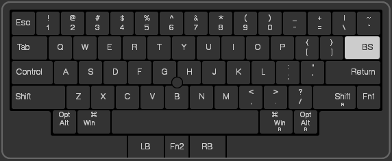 | 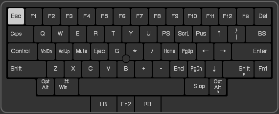 | 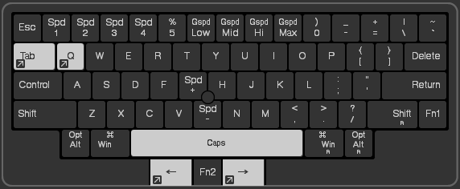     |
| 1)delete→BackSpace      | 2)Power→Esc         | 3)Tab→Win+Tab           |
|                         |                     | 4)Q→ctrl+alt+Q          |
|                         |                     | 5)Space→CapsLock        |
|                         |                     | 6)LB/RB→Alt+[←]/Alt+[→] |

1. delete→BackSpace
   
   普通にdeleteよりBackSpaceの方が使うのでBackSpaceにしてしまいました。deleteは別に対応してしまえばヨシ！
2. Power→Esc
   
   パソコン使ってるのに電源を切る需要はどこにあるんでしょうかっていう疑問＆誤爆でスリープしまくったので~追放~
3. Tab→Win+Tab
   
   3番からは置き換えというよりはショートカットのショートカット、といった感じ。開いてるウィンドウ一覧を表示するのにWindows11のWin+Tabで表示させるのですが、Windowsキーの位置ってちょっと邪魔だしちょっとアクセスしづらいし絶妙に需要が難しいんですよね。なので頻出するタスク切り替えはFn2(右クリック左クリックの間、親指のヒエラルキー最上級)とTabを押すことでも表示可能にしました。つまり、実質的にはWin+Tab→Fn2+Tabになった感じです。
4. Q→ctrl+alt+Q
   
   これは自分のイヤホンのノイキャン切り替えショートカットです。
   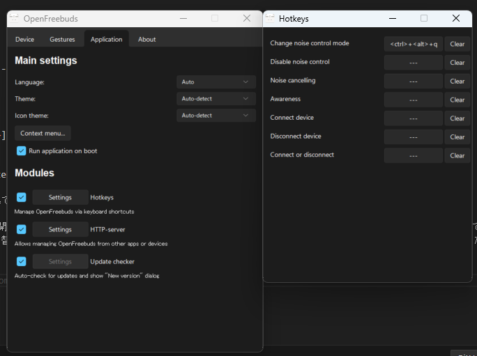
   Huaweiの[Freebuds5](https://consumer.huawei.com/jp/audio/freebuds5/)を使っているのですが、非公式に[OpenFreeBudsというソフト](https://mmk.pw/en/openfreebuds/)がありましてそこで電池残量の確認やノイキャンの設定ができるんです。そのうちのノイキャン設定が画像のようにショートカットキーが割り当てられるので集中するときと呼ばれたときの切り替えをキーボードで可能にしています。後述のスライダーと併用して、作業中にBGMを流すのに活躍しています。
5. Space→CapsLock
   
   純正のCapsLockの位置は、Fn1のTabキーになってますがこれがまぁ使いづらい。というのも、後述の理由でCapsLockを日英切り替えに使用しているため高頻度に使うのにFn1の位置も悪ければTabの位置も中途半端。頻繁に使うからもっとヒエラルキー高くしてもいいだろうと思い、Fn2+Spaceという超一等地に配置してみました。操作としては両親指でそれぞれのキーを押して切り替え。割と意識して言語を切り替えている感覚があってこれ好きになりました。
6. LB/RB→Alt+[←]/Alt+[→]
   
   写真の位置を見てもらったらわかるのですが、LBはLeftButtonでRBはRightButton、マウスの左クリック右クリックに該当します。つまり、中央のFn2を押しながら左右を押すとキーボードのAlt+矢印が発動することになります。Alt+←を入力すると、ブラウザなどで「戻る」アクションが動くのです。これにより、疑似的に5ボタンマウスのサイドボタンの機能を展開して活用できています。

#### PowerToysでの割り当て

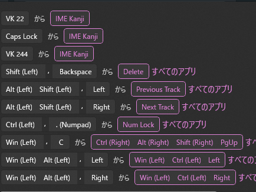
ちょっと他の設定も混じっているのですが関係する項目は次です。

1. CapsLock→IME Kanji
   
   HHKBでの5番の設定と組み合わせて日本語切り替えに使用。HHKBに直接設定しない理由としては、元のデバイス自体も英字配列でそもそも日本語切り替え機能が無いんですよね、そのためにそもそもこの役割が必要になった。
2. Shift+BackSpace→Delete
   
   HHKBでのDeleteキーをBackSpaceにしたための代理。普段他の構成でShift+BackSpaceを押すことは無いのでHHKB専用の設定で用意しました。
3. Alt+Shift+[←/→]→Previous Track/Next Track
   
   音楽の切り替えをするショートカットキー。Alt+Shift+←で前の曲、Alt+Shift+→で次の曲を再生します。HHKBの6番設定でFn2+←がAlt+←になるのでそこにShiftを押すとHHKBで動作します。
   つまり実質的にはShift+Fn2+[←/→]で音楽が切り替わることとなります。
4. Win+Alt+[←/→]→Win+Ctrl+[←/→]

   仮想デスクトップを切り替えるショートカットキー。Win+Ctrl+→で仮想デスクトップの次の仮想デスクトップに移動できますが、それをHHKBに最適化するためのキーになります。HHKBの6番設定で同じ理由でWinを押すと動作します。

   つまり実質的にはWin+Fn2+[←/→]でデスクトップ環境を移動することができるようになりました。

#### サイドジェスチャーの設定

|       | 通常時                        | Fn2                       |
| ----- | ----------------------------- | ------------------------- |
|       | 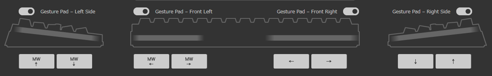 | 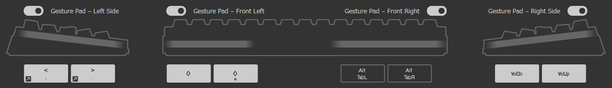 |
| 左↑   | マウスホイール↑               | Ctrl+Shift+Alt+Win+[<]    |
| 左↓   | マウスホイール↓               | Ctrl+Shift+Alt+Win+[>]    |
| 左下← | マウスホイール←               |                           |
| 左下→ | マウスホイール→               |                           |
| 右↑   | ↑キー                         |                           |
| 右↓   | ↓キー                         |                           |
| 右下← | ←キー                         | 音量上げ                  |
| 右下→ | →キー                         | 音量下げ                  |

普段はスクロールの支援として使用しているのですが、Fn2を押しながら左右端の上下スクロールで画面の制御が可能になります。
普段音楽再生をしながらFn2+右側上下で音量の調整をメインに使用しています。これが地味に便利。HHKB設定の4番、ノイキャン切り替えショートカットと一緒に音量のスムーズな切り替えに使用しています。
左側のショートカットは、Twincle Trayというディスプレイ管理ツールで画面輝度を調整するのに使用しています。
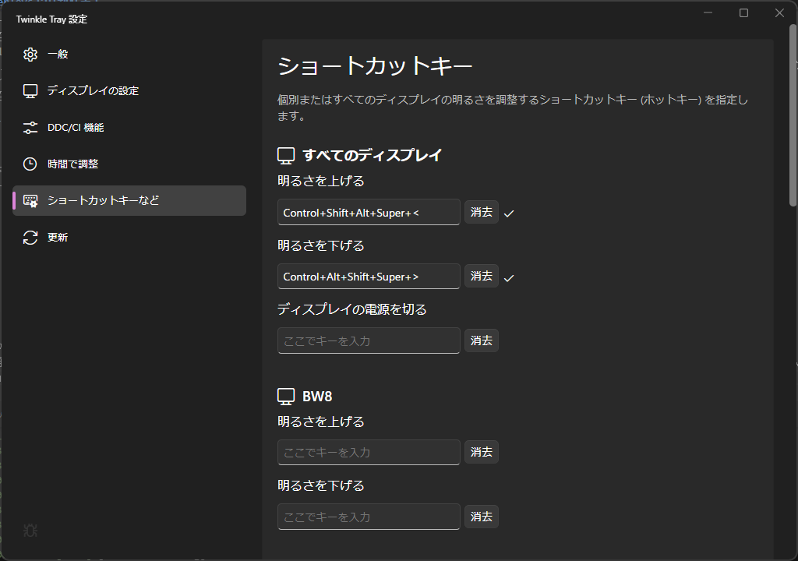
これで音量と同じように画面輝度を上げたり下げたり。気分によって明るさを調整することが可能になっています。

# 結局のところ、触ってどうだった？
数ヶ月使ってみましたが、正直言ってめっちゃ気に入りました。元々のHHKBの独特すぎるキー配置、色々触ってましたがかなり理にかなった構造をしていて、少なくともコーディングのお供としては最強だと思います。
## 1. HHKBのデフォルトのキー配列

まずこのキー配列ですが、地味に効いてるのがなんともいえない位置のctrlキー。これどういう意味でここに置いてるんだろうなぁと思っていましたが、苦なくctrlキーを小指で押せて地味にショートカットが押しやすい。左下にctrlを持っていくのって地味にストレスだったんだなぁと思いました。コピペが地味にめっちゃ操作しやすい。なんでこれまでなんとも思わなかったんだろうな。不思議。でももう慣れてしまった。慣れたらかなり爆速になる。ただ、相応の覚悟が必要ですねこれ。日本語をメインに利用するユーザーには主にメリットは感じないのかもしれない。

## 2. 中央に鎮座するトラックポイント
これもですね、慣れが必要ですがかなり使い勝手が良いです。正直、細かい処理とか一気に移動させるとか極端な作業には向いていないのですが、マウスポインターを動かすのにマウスに手を動かさなくていいっていうのはものすごいメリットですね。机からもマウスが消えましたし、腕の移動も無くて楽で快適です。画面のスクロールもFn2とトラックポイントで一気に移動できて長距離スクロールもなんのその。使い慣れるなら使った方が圧倒的に楽です。おすすめしたいけどこれもおすすめしにくいよね...

## 3. 何かに目覚めそうなサイドジェスチャー
上記のカスタムに書いたように、サイドジェスチャーもマウスキー関係も特にメディア関連でめちゃくちゃ快適に使用しております。

色々最初は使い方に悩みましたが、結果的にデバイス制御方面に安定しそうです。雰囲気的には一時期のmacに搭載されていたタッチバー的なものを感じているので、Fnキーで更に用途を考えることができたら拡張していきたいなと思っています。

## HHKB Studioのための独自の軸 #とは
どんな軸なんだろうと思って触ってみたものの、触ってみてもよくわからない。なんだろう、このなんとも気持ちの良い軸は。何が一番良いかって、音が静かなんですよね。全体的にコトコトとした音で、青軸のようなカチカチ感も無い。富士通の学校とかによくあるようなメンブレンみたいなうち心地を良くした感じですかね...?凄く不思議なうち心地。仕事に使用してもぜんぜん静かで周囲に邪魔にもならないし、どこに置いてあっても問題ないなと思いました。こんな特徴の薄く、でも心地よいうち心地はどう表現したものかわかりません。でも、凄く好きなんですよねこれ。凄く気に入りました。(日本語にできない感覚なので脳直APIで書き込みながら感じたことをそのままお届けいたしました)

# 既に見つけたデメリット
## 乾電池4本！！3か月で消耗！！
使用を開始し、ちょうど三か月で電池切れ警告が出ました。ちょっと消費激しくないです？そういうもんかな？あまり考えたことが無かったけど流石に乾電池をこのテンションで消耗してたら大変なことになりますね。仕方ないのでエネループ投入しました。

## トラックポイントは完璧なマウスの代替にはならない
どうしてもリニアな制御になるので、FPSのような瞬間的に画面の移動が必要なシーンが出現するゲームには向かない。Minecraftを時々するのですが、トラックポイントで操作は流石に無理でした。普通のキーボードも普通のマウスもゲームには必要。代替はちょっと厳しそうですね...

## サイドジェスチャーの位置が微妙にわかりづらい

このサイドジェスチャー、よ～く見ると二段階に別れてます。上の段がジェスチャーの範囲で、下の段はただの側面です。これのせいで、触ってるつもりなのに触ってたのはただの側面っていう状態が多発しました。だいぶ慣れてるけどまだ時々ミスる。

## サイドジェスチャーの感度、変？
触ってると急に動くときもあればなかなか動かなくて擦るときもある。感度とか言う話ではなく、なんかスリープ復帰しないような、そんな感じの『応答していない』時がある。

# Q:おすすめする？
A: まず触らせてからおすすめする！慣れたらマジで有能！こんな楽なキーボードは無い！これはいいキーボードだといえます！おすすめです！(癖に適応できるかはまた別の問題なのでそこが鍵となりますね)

私はこれからもこのHHKB Studioを常用することは確実です。慣れたら他のキーボード触れなくなりそうだし、時折他のキーボードやノートパソコンのキーも触るので完璧にこれだけというわけではないですが、万人受けはしないものの特定の人間には間違いなく刺さることでしょう...~~これはもう、宗教だ...~~