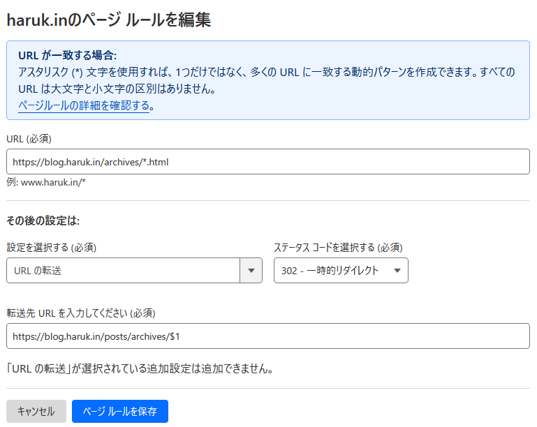

- 後の作業の備忘録のために書き起こしています。
# 二つのブログ
ここ数日、思い立ったので二つあったブログをリニューアルしました。

片方は[Xprocess-info](https://xprocess.haruk.in)。もう片方は[harukinのブログ](https://blog.haruk.in)です。

前者はNextcloud-PicoCMSからHexoへ移行

後者はLivedoor-blogからAstroへの移行でした。

記事を移植させるのも大変でしたが、それ以上にリダイレクト設定が大変でした。

# Nextcloud-PicoCMSからHexoへ移行したXprocess-info
元々はJR四国アプリの更新情報の表示用のページをNextcloud上でサクサク管理できるよということで作成したので、どうしてもNextcloudのアップデートが遅れがちで、PicoCMSのアップデートができない状況が続いていました。

元のアドレス
`https://nexcloud.haruk.in/sites/press-harukin/JRShikokuApps/(日付のような固有のURL)`
新しいアドレス
`https://xprocess.haruk.in/(生成日)/(固有のURL)`
この状態で簡単にリダイレクト設定をするのはちょっと大変そうだったので、二段階に分けることにしました。

## Nginx側でのリダイレクト設定
色々考えて試してましたが、なんだかんだとうまくいかなかったので、Nginx側でリダイレクト設定をしました。
```nginx
## 新アプリ通知ブログへのリダイレクト
location ^~ /sites/press-harukin/JRShikokuApps {
    rewrite ^/sites/press-harukin/JRShikokuApps/(.*) https://xprocess.haruk.in/$1 permanent;
}
```
正直、これも何故これでうまくいったのかはわかりませんが、とりあえずこれでリダイレクト設定は完了です。もっとスマートにできるはずなんですが自分の知能が低すぎるなぁ...
これによって、

`https://nexcloud.haruk.in/sites/press-harukin/JRShikokuApps/(固有のURL)`

が

`https://xprocess.haruk.in/(固有のURL)`にリダイレクトされるようになりました。

## Hexo側でのリダイレクト設定
色々試してましたが、どうやっても流石に日付の部分はnginxでの設定では対応できないと判断したのでHexo側で個別対応することにしました。

Hexo側でのリダイレクト設定は、`hexo-generator-alias`というプラグインを使いました。

記事のmdのトップにaliasという項目を追記すればそのURLからリダイレクトされるようになります。

新機能ニュースの例:

```md
---
title: "[JR四国非公式アプリ]新機能ニュース ver.4.1 (2022/04/14)"
date: 2022-04-14 09:03:07
cover: "/assets/JRShikokuAppsArchive/2022-4-13/assets/22-04-1306-16-123601.png"
alias: "2022-4-13.html"
tags:
  - "JR四国"
  - "JR四国列車位置情報アプリ"
  - "MobileApps"
---
```

ここでの2022-4-13.htmlがリダイレクト元のURLです。htmlのあるなしにかかわらずここにはhtmlを記入しないと動作しないようなので、目標のURL+htmlを記入しておきます。

これによって、`https://xprocess.haruk.in/2022-4-13.html`にアクセスすると、`https://xprocess.haruk.in/2022/04/14/2022-4-13`にリダイレクトされるようになります。

この日付の部分はHexoによって動的生成されるのでこのような準備が必要になりました。これを当該の記事に対して全て行いました。

この二段階のリダイレクトを活用し、既存のアドレスからのアクセスをさばいてます。
記事自体はもともとMarkdownで書かれていたので、Hexoに移行する際にはほとんど手を加えることなく移行できました。ファイルもHexo側に移行済みです。

# Livedoor-blogからAstroへの移行したharukinのブログ
こちらもこちらで、Livedoorの入力機能がなかなかに使いづらかったのでMarkdownぐらいでサクッと書きたいなと思い、Astroに移行しました。
元のアドレス
`https://blog.haruk.in/archives/(記事ID).html`
新しいアドレス
`https://blog.haruk.in/posts/archives/(記事ID)`
本当はAstro側にはarchivesはいらないのですが過去記事との見分けができるように今回はarchivesの下に置くようにしてます。これはadtroのcontentのディレクトリ構造で決まるので自由に変更できます。

## Cloudflareでのリダイレクト設定
こちらはCloudflareのPage Ruleを使ってリダイレクト設定をしました。が、これがなかなか似たような項目が多くてよくわからない。
結論から言うと、設定画面はDNSとか触れる設定の階層の「ルール」→「ページルール」で設定します(どうやらこれは最大三つまでしか使えないから結構考えないといけないな...変更するかも)。

どうやら、ページルールの*のワイルドカードを設定するとその中身が$1に抽出されるのですが、これを使って都合よくIDだけ抽出できるっぽい。

なのでうしろのhtmlが書いてなかったらhtmlも付いた文字列が$1に入っちゃうみたい。

こっちの設定はこれだけでよかった。簡単。

でも記事自体は完全にゴリゴリのHTMLで構成されてて修正も面倒だったので画像もそのままHTMLをコピーして貼り付けてます。良くない。そういうこともあってあまり触りたくないのでarchivesの下に置いてます。黒歴史だよこれは。