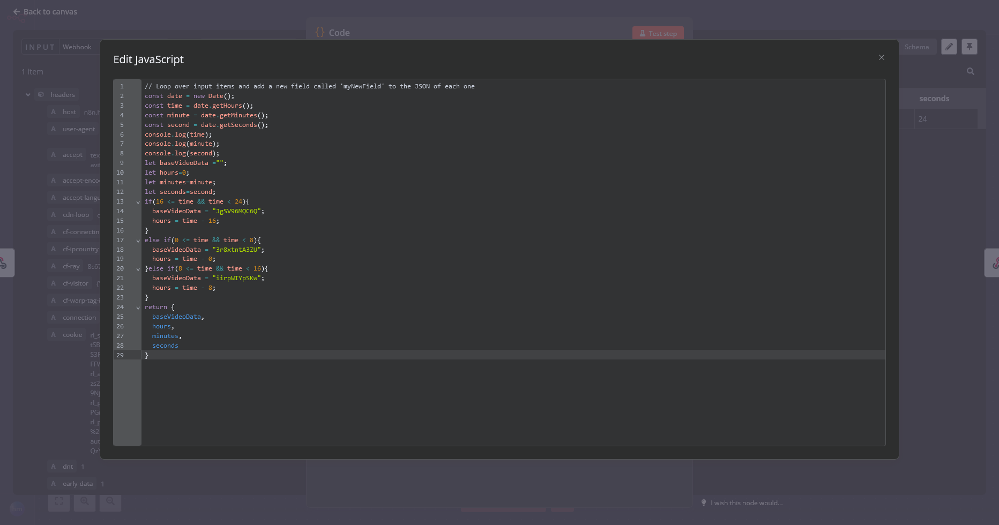

# TL;DR
## [これを開く(https://haruk.in/nc)](https://haruk.in/nc)

# ナイトコードのみんなと作業したい
<blockquote class="twitter-tweet" data-media-max-width="560">
ニーゴの作業配信、普通に時間長いから仕事の裏で流してたら色々とちょうどいいし一定の休憩のタイミング作ってくれるのも助かるw 普通に使えるなこれwwwww <a href="https://t.co/q311lGiHgk">pic.twitter.com/q311lGiHgk</a>
&mdash; Hairs UK Intelligent٩(✿ &#39; ᴗ &#39; )۶ (@mhkai00731) <a href="https://twitter.com/mhkai00731/status/1836383491082379425?ref_src=twsrc%5Etfw">September 18, 2024</a></blockquote>  

まず、ニーゴとは、ナイトコードとは何か、という部分は公式ページを見てほしい。

https://pjsekai.sega.jp/character/unite05/index.html

このニーゴというユニット、要するにリモートワーク的なことをして音楽を作っているサークルなのだが、2年前にこのリモートワークの様子を24時間ライブ配信するイベントがあったのだ。

https://www.youtube.com/playlist?list=PLiFNg5fXiX30V5cUTQ9wZ6C6XUNk9Vuqy

この動画では、8時間*3の24時間の動画が繋がっており、この中でニーゴのメンバーたちが通話を繋いでそれぞれ作業をしている。動画の視点は奏のパソコンの画面で音声も奏のマイクから拾う形となっている。

見ているだけでもKが(PC)キーボードを叩いていたり、(MIDI)キーボードを叩いていたり、えななんがペンタブでお絵かきをしている音が聞こえたり。Amiaとわちゃわちゃやってたり雪も歌詞を投げてきたりすごく普通に作業している様子が見れる。この、**普通に作業している**というのが重要で、雑談とか気が散る要素が少なく、各個人がもくもくと作業をしているのだ。この微妙な会話数と、微妙なキーボードの音、そこそこの人の出入りがあるので、物凄く「雑音」として置いておける。

# この雑音を使って「一緒に」作業する
彼ら自身も勿論人間の挙動をしているので、タイミングによっては寝落ちしていたり飯を食いに行ったりする。これを聞きながら普通に作業すれば、ある程度の時間間隔を持ったまま作業ができ、ある程度の生活リズムが保てそうだ(なお時間帯は無視するものとする)。

実際、これは当時24時間ライブ配信をされていたわけで、その時は流れている動画の時間と現実の時間はリンクしていた。自分も作業しながらこの配信を時々見て、「誰が何してるかな～」と確認したものだ。動画として、プレイリストとして公開されているので現状でも見れるわけだが、これをリアルタイムで見ることはできない。...まぁ自分で分数計算して配置すればいけなくもないが、ちょっと面倒だし通話に参加している感はないよねぇ・・・ということでこのリンクを作成した。

# 作成したリンクとその仕組み
https://haruk.in/nc

↑このリンクを開くと、先の24時間プレイリストの中から、「現在時刻を取得した動画の途中からのリンク」を生成し、リダイレクトされる。例えば夜中の3時に開いた場合、1本目の2時間目の途中から再生される。このリンクをいつ開いても微妙に違う時間から再生されるので、いつ開いても同じような感覚で作業をすることができる。

使用しているのはn8nというツールで、これは**ノーコード**でワークフローを作成できるツールだ。このツールを使って、現在時刻を取得し、その時間に合わせてプレイリストの中から動画を選択し、その動画の途中から再生するリンクを~javascriptを書いて~生成している。

このn8nで生成されるアドレスはn8nのwebhookのものなのだが、もっとスムーズに遷移し、なんならキーボードでの叩きやすさも優先してcloudflareのbulk redirectでリダイレクトを行っている。これにより、https://haruk.in/nc にアクセスするだけで、リンクが生成され、リダイレクトされるぞ。

# 作ってみて
普段仕事がリモートというか、一人でもくもくと作業することが多いので邪魔にならないほどの騒音を求めていたのでこういう作業音は大歓迎。ちょっとしたランダム性、そこに人がいるようなリアルタイム性があればもっと使いやすいのにな～、と思っていたので作って作業がかなり楽しくなった。友達と作業通話を開いたら、結局雑談ばかりになってしまうので、こういう形が自分には合っているのかもしれない？ニーゴ推しの奴らには是非使ってもらいたいかもしれない。
本当はn8nなんて使わなくてももっとシンプルに作れるはずなので、完全サーバーレスでストレスなく運用できるようにしたいね。