# [とあるアプリ](https://haruk.in/?page=Apps&app_id=JRShikoku)と駅名板(ｽﾃｰｼｮﾝﾎﾞｰﾄﾞ)

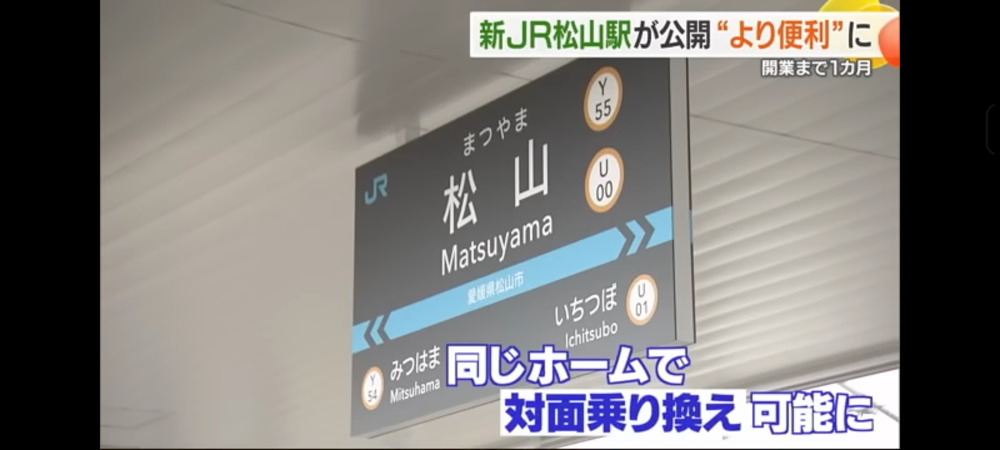

突然だが、これは2024年の9月30日に新規開業するJR四国の松山駅新駅舎にある松山駅の駅名板だ。

JR四国の民なら割と驚くのだが、この駅名板、**なんと黒い**。これまでの四国には無かったスタイルだ。しかもなんかカッコいい。なんだこれ、こんなの無かったろこれまで。

こんなカッコいいモノを見てしまっては、採用しなければ無作法というもの。実装したいよな。しかもなんかカッコいいからうまいこと使ってやりたい。ずっとやろうかな～と思っていたネタを一つここで使うことにした。

# FigmaとLottieとLottieLabと

その名そのものは知っていたし、ちょっとは触ってみたことはあるし、JR四国アプリにもすでにLottieは導入済みだったりする。JR四国アプリの読み込み画面で■が四つぐらいグルグルしてるのを見る機会があるかもしれないがそれだ。

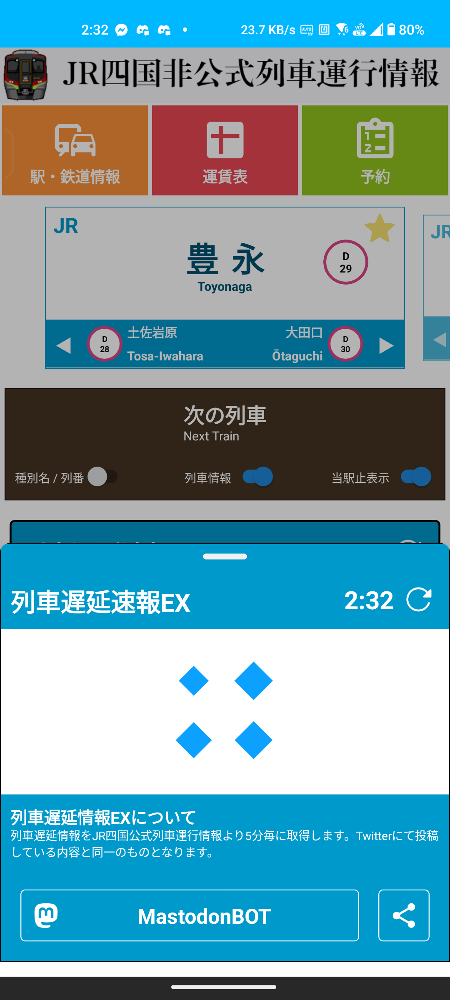

触ったことはあるし、一度はAdobeのAfterEffectで作ったこともある。ただし、既にAdobeは解約してしまったしこれ如きで契約するのもなぁ。

そんなことを考えていたときこれを思い出した。
<blockquote class="twitter-tweet"><p lang="en" dir="ltr">This was fun to recreate!! Learned a lot 🔥<br><br>Recreated <a href="https://twitter.com/sawaratsuki1004?ref_src=twsrc%5Etfw">@sawaratsuki1004</a>&#39;s <a href="https://twitter.com/github?ref_src=twsrc%5Etfw">@github</a> in <a href="https://twitter.com/figma?ref_src=twsrc%5Etfw">@figma</a> then animated it in <a href="https://twitter.com/LottielabHQ?ref_src=twsrc%5Etfw">@LottielabHQ</a> <br> <br>Remix 👉 <a href="https://t.co/qsabLcbMUl">https://t.co/qsabLcbMUl</a> <a href="https://t.co/XpoYDBviCy">https://t.co/XpoYDBviCy</a> <a href="https://t.co/jwQWQi6y0c">pic.twitter.com/jwQWQi6y0c</a></p>&mdash; Daryl Patigas (@darel023) <a href="https://twitter.com/darel023/status/1782224694973989036?ref_src=twsrc%5Etfw">April 22, 2024</a></blockquote> <script async src="https://platform.twitter.com/widgets.js" charset="utf-8"></script> 

Figmaで作って、LottieLabでアニメーション化する。これはいいぞ。

# Figmaで作ってみよう

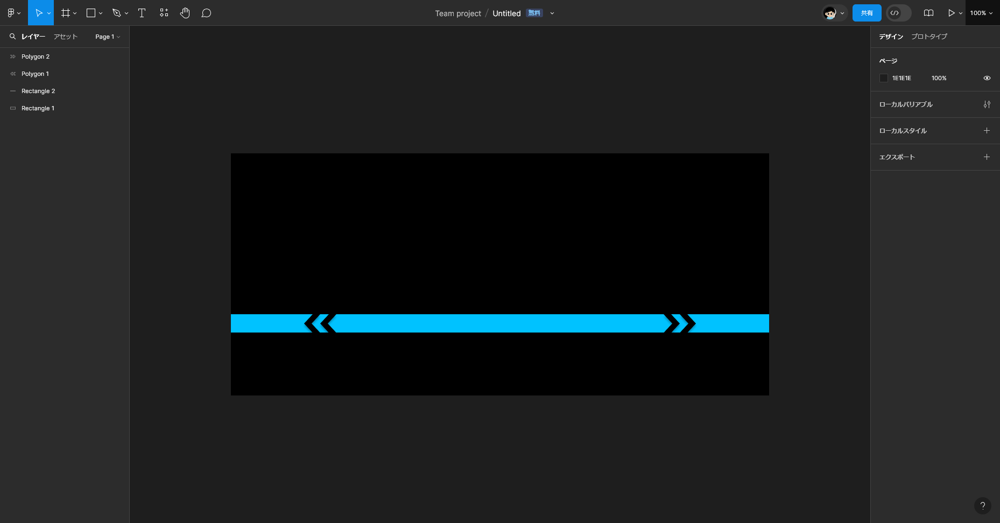

Figma自体は割と単純なツールなので結構簡単にベースを作ることができた。

Figmaで作成したいのはこの帯線の部分だけ。ちょっとこれをJavascript上で再現するのは大変そうだったから。

レイヤー的には、四角の背景、四角の青帯、矢印部分の三種類に大別される。

矢印の部分は6点のポリゴンを普通に配置しただけ。一応管理のしやすいように、それぞれのポリゴンの配置に規則性を持たせて配置したのを並び替え、回転などして配置している。


# LottieLabへの出力

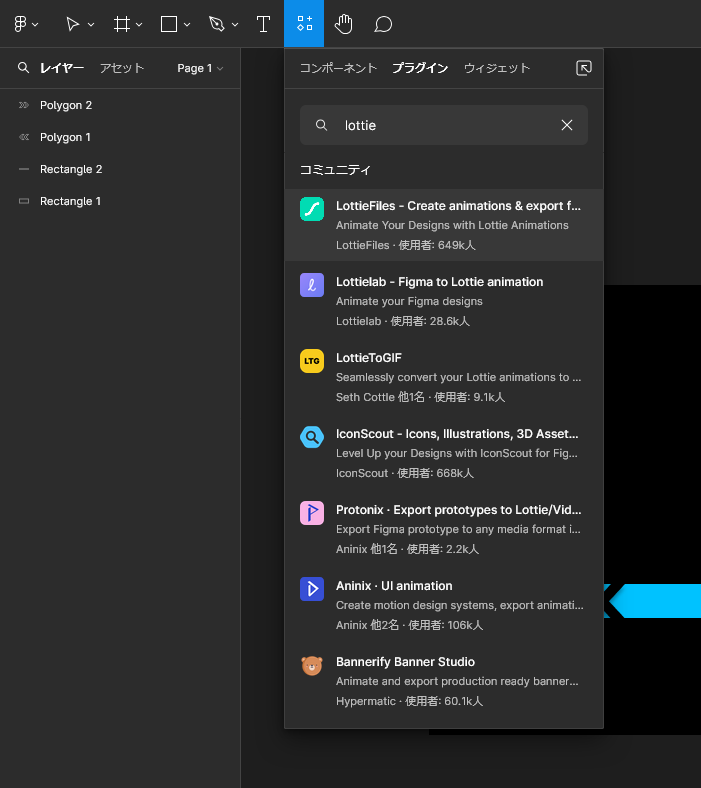
メニューの「リソース」からプラグイン、検索画面に「Lottie」と入力すると「LottieLab」が出てくるのでそれをクリック。
 
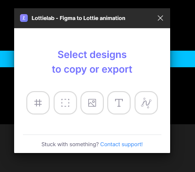
そうするとこんな小窓が出現するので

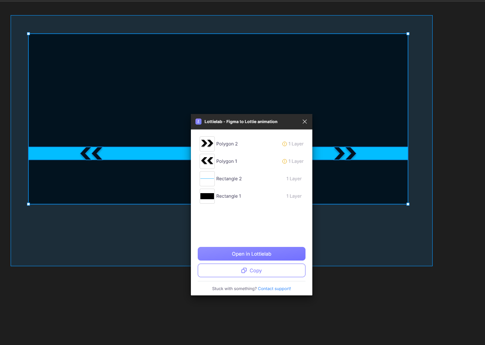
LottieLabで開きたい範囲をｶﾞｯと選択して「Open in Lottielab」を押すと

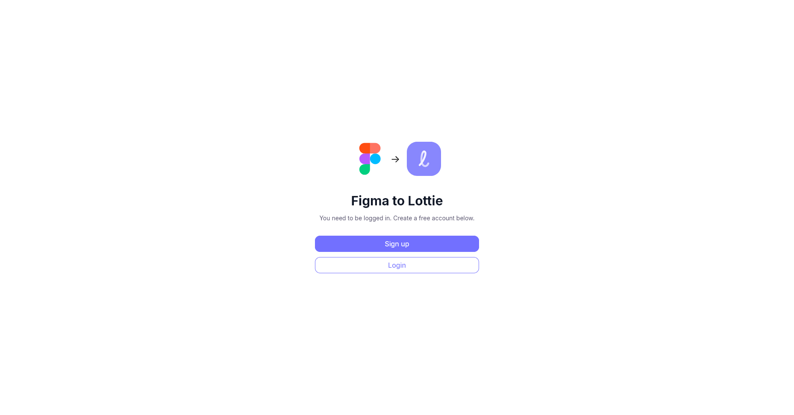
こんな画面が出てくるのでSignupかLoginをする

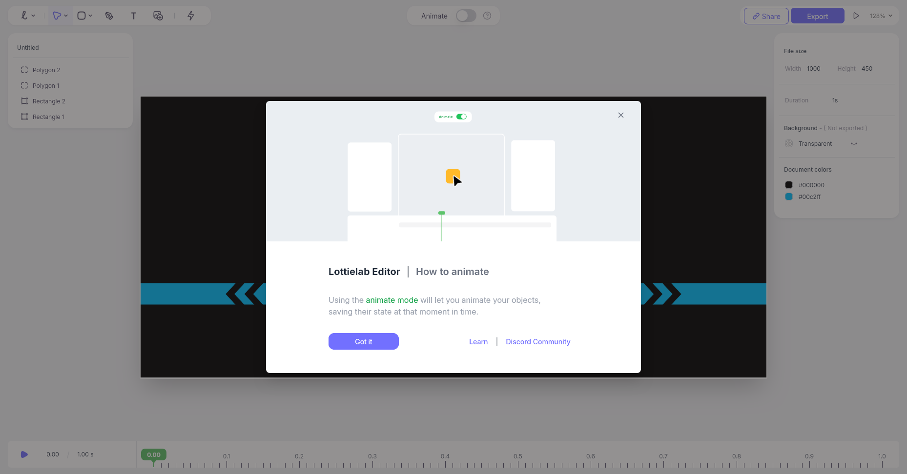
そうすると、こんな画面が出てくるので軽く説明を読んだうえで「Got it」

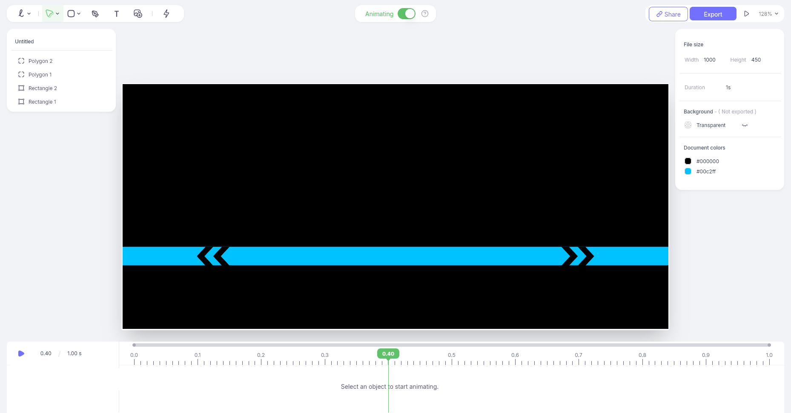
上部の「Animating」のスイッチを入れると、動画編集とかでよく見るタイムラインが出てくるので、ここでアニメーションを調整する。

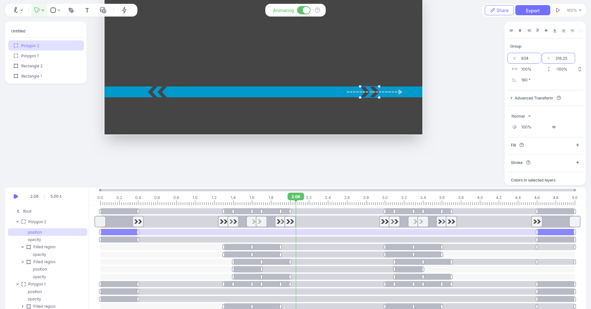
アニメーションを調整してみた図。それぞれのキーの時点での目標位置に移動させる。それぞれのキーフレームで設定できる項目も色々豊富なようで、ざっと見た限りは回転や移動、アスペクト比変更を伴う変形、明度変更、色の変更などもできるようだ。

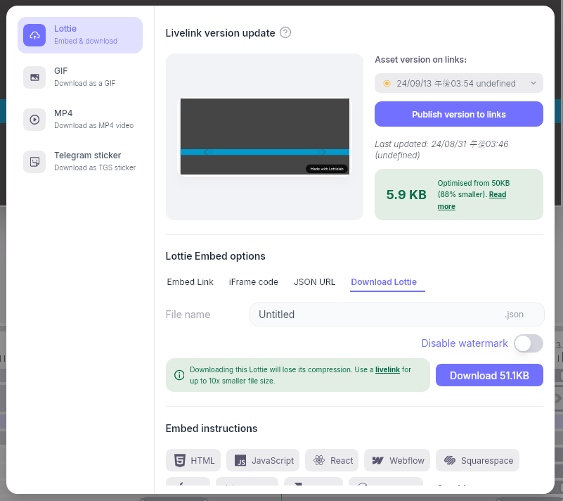
完成したら、右上のExportを押すとこんな画面が出てくるので、ここで「Download」を押すとJSONファイルがダウンロードされる。因みに、GIFを押すと解像度や速度、fpsを指定してGIFをダウンロードできるようだ。
ダウンロードしたGIFがこれ↓


結構いい感じに動いてる。かわいい。この動きは、移動と透明度変更だけで時間差で動くように調整した。上等じゃないか？とても簡単に作れたな。

ただ、このGIFを見てわかる通り、右下には「Made with Lottielab」が表示されている。これは無料版の制限で、有料版にすると消すことができるようだ。ただし、有料版は月額$24となっている。ちょっとそこはなぁ～。どうしたもんかなぁ。今回はこのロゴの部分はReact側で上書きして消えてしまうので一旦気にしないこととした。いいのかな...??w

# ReactNativeで使ってみる
もうここまで出来たらReactNativeで使ってみるのは簡単だろう。作成したJSONファイルを読み込んで表示するだけだ。

```javascript
<LottieView
    autoPlay
    loop
    style={{
        width: wp("80%"),
        height: (wp("80%") / 20) * 9,
        backgroundColor: "#fff",
    }}
    source={require("../../assets/StationSign.json")}
/>
```

styleは適当にして、sourceには作成したJSONファイルを指定するだけ。これで動く。

JR四国非公式位置情報アプリの場合は、これにオーバーレイで駅情報を付与するためAbsoluteでtextを重ねている。


ね、割といい感じじゃない？かわいい。こんな簡単にアニメーションが作成できるのって、便利だわね。これからも要所要所で使っていこうかなと思う。