どうもharukinです。

iPhone 14 Proが2年縛りを終え、機種変タイミングになったのでサラッと機種変しました。軽く触って思うところを書いていきます。

:::warning
**この投稿は基本的にアンチが機種変して感じた批判記事になります。信者の皆様は早急にブラウザバックをお願いします。** なんで買ったんだよって？アプリの開発用デバッグがメインだよ。あとカメラもある程度の品質は保証されてるから(一応これで、手持ち端末では一番強いカメラ端末にはなる)
:::

# 本体のデザインについて
### 本体を並べた画像
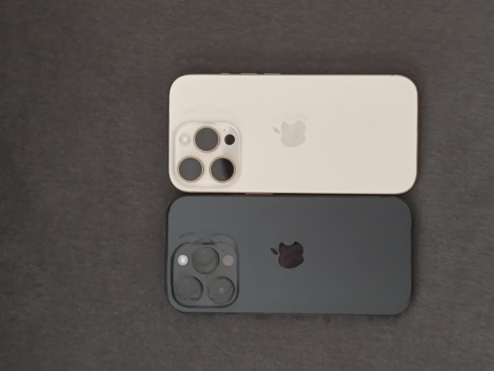
デザインはほぼ変わってません。横幅も変わってないので、ほぼそのままのサイズだと思いました。しかし、どうも縦にちょっと長くなっていますね。つまりアスペクト比また変わったのか...え、変わったの？このわずかの期間に？また？

### ベゼルレスがめっちゃベゼルレスとみんなは言うけれど
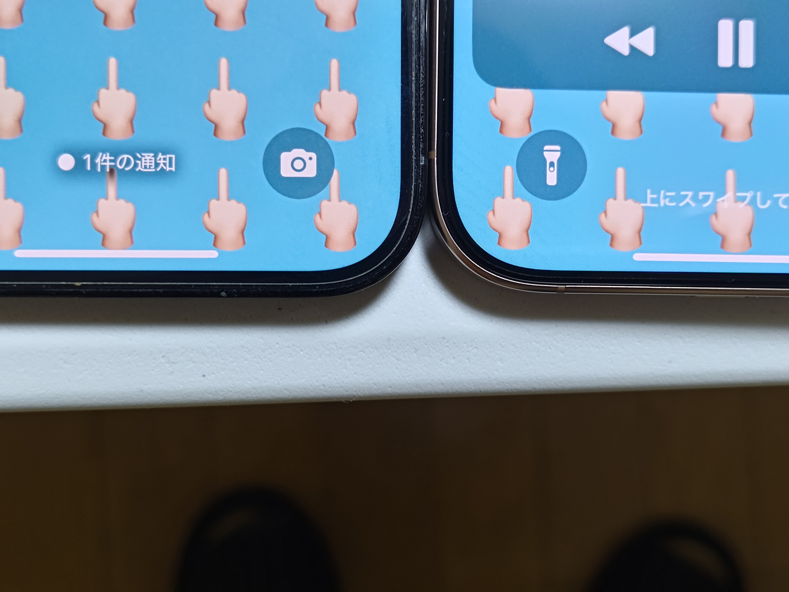
ベゼルの様子も軽く見ましたが大した変化は無いように感じます。でもカーブのRが変化しているっていうのは本当なんですね。ほぼ気にならないですけど。

### カメラ周り
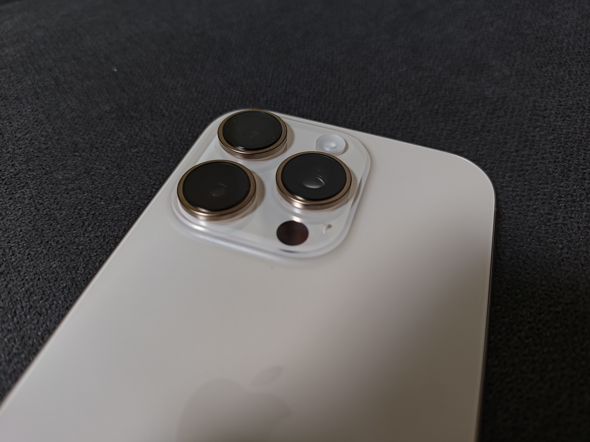
ご自慢のカメラ周り、今回初めて白系なiPhoneを買った(色をほとんど考えずに買った)んですが、カメラ周りのこの枠って...透明？なのかな？なんか物凄い安っぽく感じてしまうんですが私だけですか？14Proも透明だったのかな、黒系だったからか色に差があってちゃんとデザインとして成立していたような気がするんですが...個人的に無色透明っていうのはデザインとしては微妙な気がします。無い方が良くない？うーん謎の気持ち悪さがある。透明部分そのまま消して、色を付けてデザインに意味を持たせたくなる。数年経ったら黄ばんでそう(そんなことはないだろう)

14Proのカメラ周りはちゃんと黒いんで透明じゃなくて着色された半透明の素材なんだと思ってましたがそれ自体が勘違いだったんですかね？

### 側面
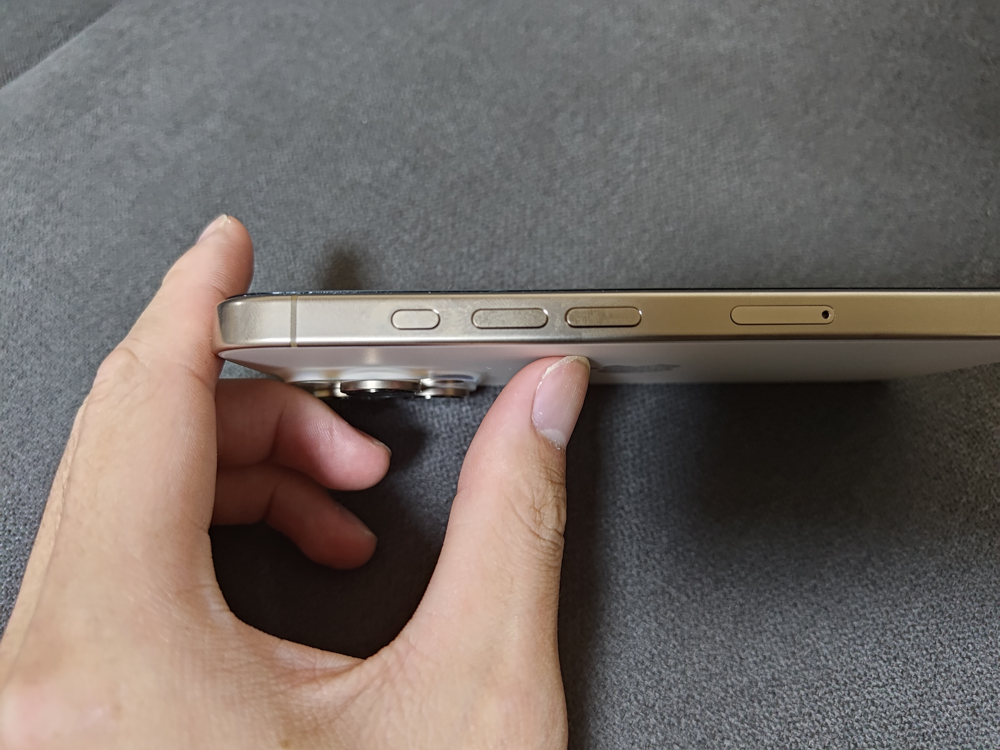
側面のバンパーとかのチタニウムデザインは好きですね。嫌いじゃない。独特な光り方、結構好きです。14Proの時のような安っぽい光沢プラスチック的な色とは全然違うのがわかる。

# 増えた機能についての感想
## USB Type-C
これに関してはEUグッジョブ。単純にケーブル減らせて便利ですよね。まぁ私は充電はワイヤレスを基軸としてますし、パソコンと繋いで通信することもあまりないので問題らしい問題は無いんですが、これで懸念事項が払拭されてるので良いことだと思います。
## ショートカットキー
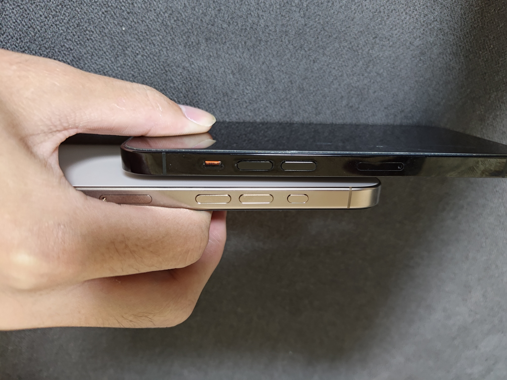
これも15Proから実装されましたが、個人的にはすご～～～く微妙。いや、いつも通りのスイッチでええやん..っていう批評は別にユーザーにとって色々感じるところはあるのでいいとして、割と想定していなかった致命的に気になる問題として、**割とボタンが近しく並んでいるので間違える** というところ。カバーを付けると特にその傾向が顕著になるんですが、近しい距離感でボタンが三つ並んでるんですよ。前はスイッチだったのでスイッチは物理的に別の形状をしていましたが、どうにもこの15以降のショートカットキー、距離が近いんで音量ボタンと勘違いするんですよね。慣れだというのはわかるんですが、こう、もう少しボタンの長さ変えるだけじゃなくて指を掛けたときの形状から見直すべきじゃなかったんですかね。こんな、全く別なのに似通った操作形態の似通った操作感のボタンがこの配置で並んでるのって、良くないと思うんですよ...

## カメラボタン
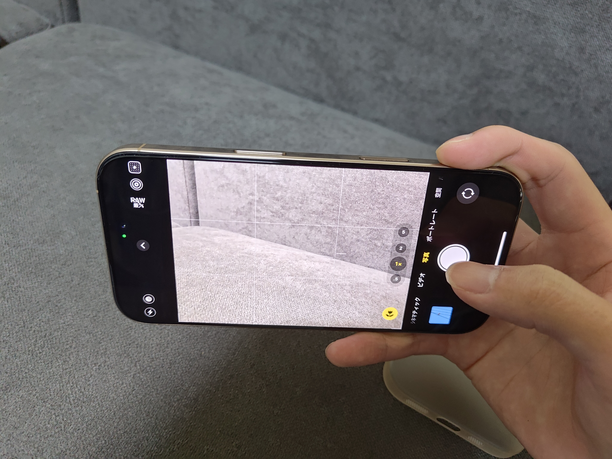
これ、ぶっちゃけ言いますと **あり得ないぐらいに扱いにくい。** 開発担当の指ってどういう形状してるんでしょうね？普通にカメラとして持ったらそこには来ないのよ。暴言失礼します。 **馬鹿じゃねぇの？** 
操作方法も意味不明ですし、使える機能も非直感的でタッチパネル触ったほうが明らかに高速に操作できる。
1. ボタンを押し込むとこの謎コントロールがアクティベートされる。どうして？その儀式はいったい何？？？？
   ↓
2. そこから一生懸命左右にスワイプしてズームをしますが **普通に画面にあるズーム使った方が100倍速いのよ。なんでそんな限られた範囲を指往復するんだよ。**
   ↓
3. そこからまたボタンを*ダブル半押し*すると他のメニューが表示される。難易度高すぎじゃない？？
   設定できる機能は、[露出、被写界深度、ズーム、カメラ、スタイル、トーン]の6種類。これら、全部タッチパネル上で設定できる。この謎のUIで設定する必要が全くない。
   ↓
4. そんな画面で更に強く押すとシャッターが切られる。
   いやいや...そんな色々な設定、撮影前に設定すればええやん。マジで何の需要があるんだこのボタン。仮に場所変えても、それだけじゃ全然ダメ。撮影直前に急いで設定を微調整するUIにしては明らかに操作形態が適していない。これ、どう考えてもタッチパネルでやるべきだろ。

あと、カメラのシャッターボタンとして重要だと思っているポイントとして、シャッターって普通凸ってるんですよ。押しやすいように。でもこれ、凹ってるんですよ。なんで凹らせた？これもまた操作性の悪化に一役買ってると思います。

↑

これ書いてて思ったんですけど、これ要するに
### **アクションボタンにカメラ割り当てたんでよくねー？？**　
んで気が付いちゃったんですよ。
### **アクションボタンでシャッター切れるじゃん。**

んで、私の至った当分の運用手法がこれです。
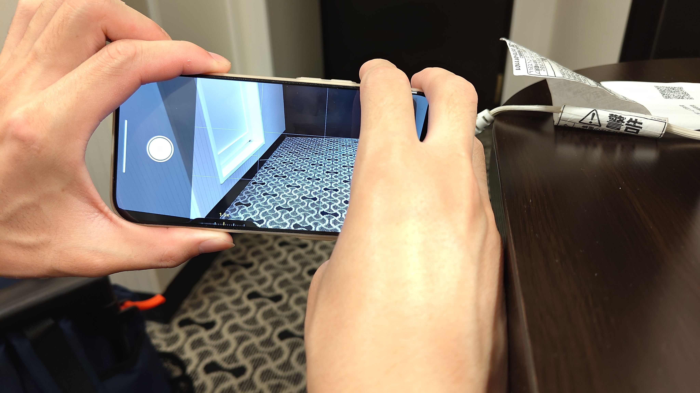

アクションボタンでシャッターは切る。構えた姿勢で暇をしている左手親指でズームなどの調整をする。そう、一眼でリングを回すみたいに！！！！これ、どうです？良くないです？この使い方、いいんじゃないかと思ったんですが一つだけ問題点があるとすればそれは、手がカメラに掛かってしまうことですね。右手の下にカメラが来ると結構邪魔になる。まぁ頑張って使ってみよう。。。

## その他
基本的にそれ以外は普通にiPhoneですね。性能が上がったとはいえそもそも元々のスペックでも足りてましたし、AIがなんだかんだ最近実装されましたが日本ではまだ先のお話...
この記事の結論としましては、いつも通りのiPhoneなんですが最近の変更点には疑問符がつく内容が非常に多く賛同しにくい。それも単に自分の好き勝手で済めばいいものの、「人体の仕組み的にその設計はそもそもおかしいだろ」という方向の疑問符が多いのがとても気になります。iPhoneのファンの皆さんこれにどういった印象を持っているんでしょうか、少なくとも初回公開時にはそれなりに盛り上がってましたが触るまでもなく微妙なのがわかりきってましたが。

とりあえずこの変なカメラボタンは変化形で使ってみて、カメラ係、その他開発用として机の片隅に置いておくことにします。

# おまけ
カメラで撮影したお気に入りの画像をいくつか投稿しておきます。カメラの品質もそこそこ、少なくとも14Proよりは良好になったがすごくいいという感じでもない。でも夜は割と狙った以上の画が撮れるから悪くはない、っていう感じですね。

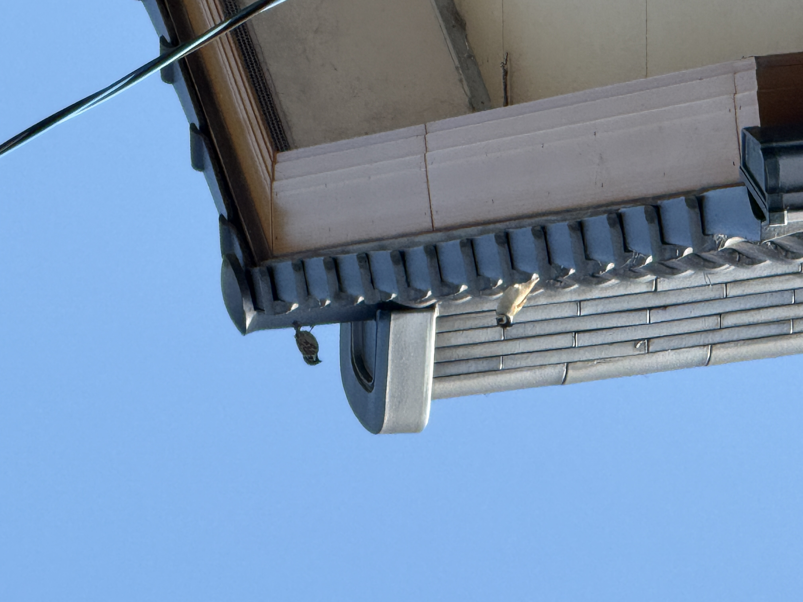
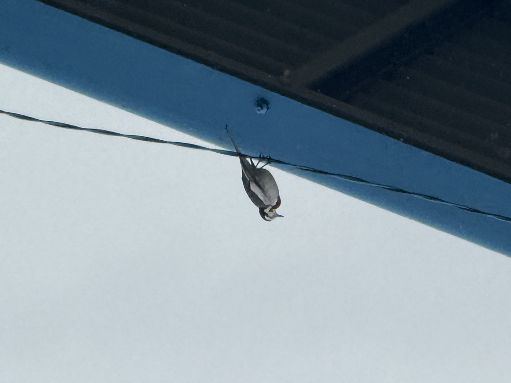
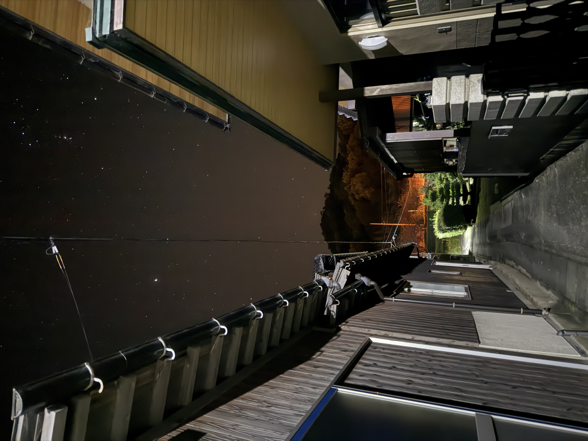
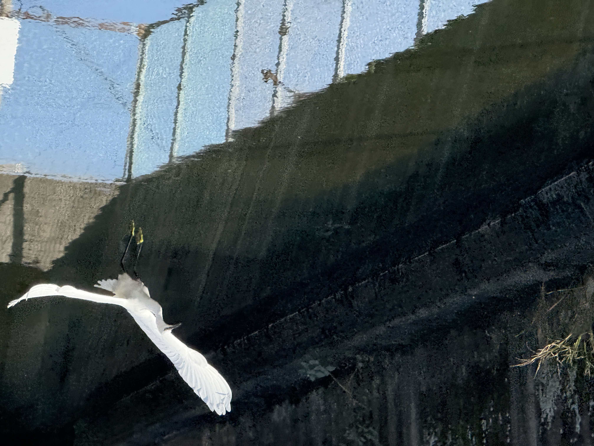
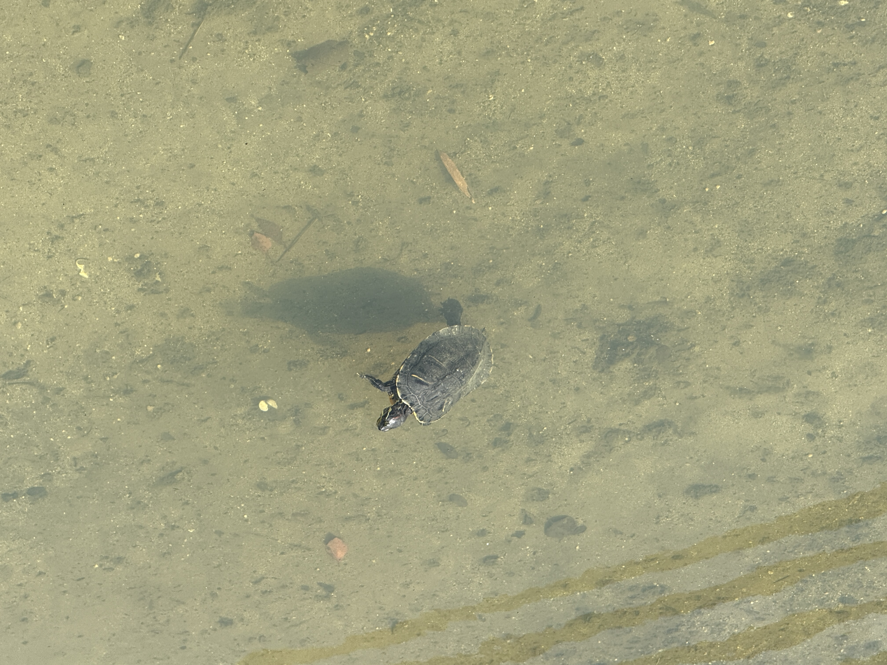
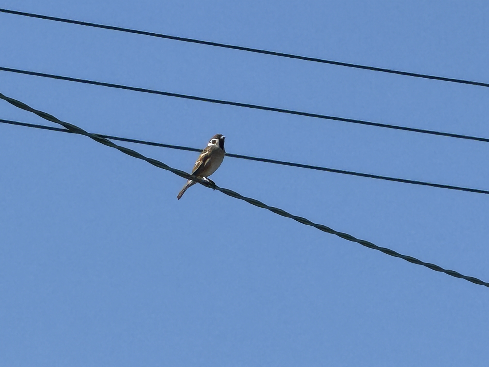
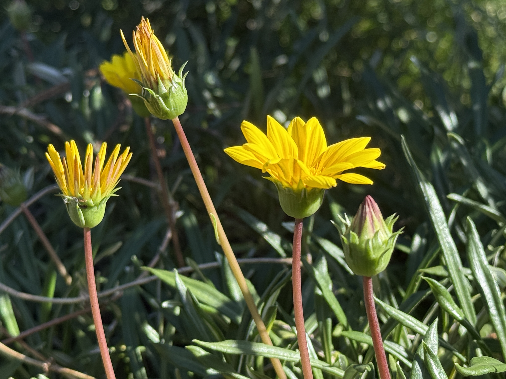
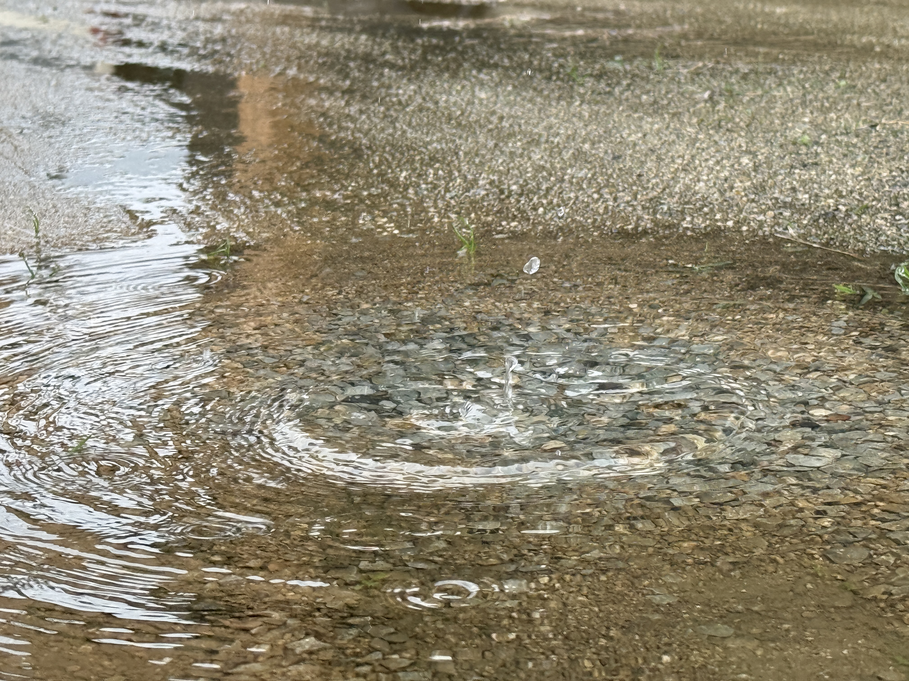

<blockquote class="twitter-tweet" data-media-max-width="560">
カメラボタンって便利だよね。 <a href="https://t.co/YLxYhsaB7q">pic.twitter.com/YLxYhsaB7q</a>
&mdash; Hairs UK Intelligent٩(✿ &#39; ᴗ &#39; )۶ (@mhkai00731) <a href="https://twitter.com/mhkai00731/status/1857427544456253693?ref_src=twsrc%5Etfw">November 15, 2024</a></blockquote>  