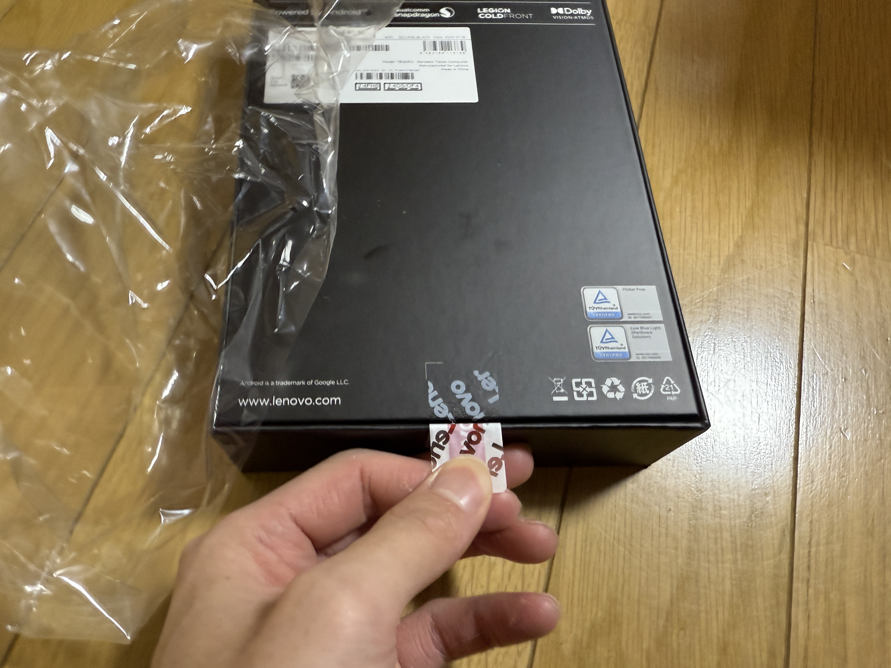
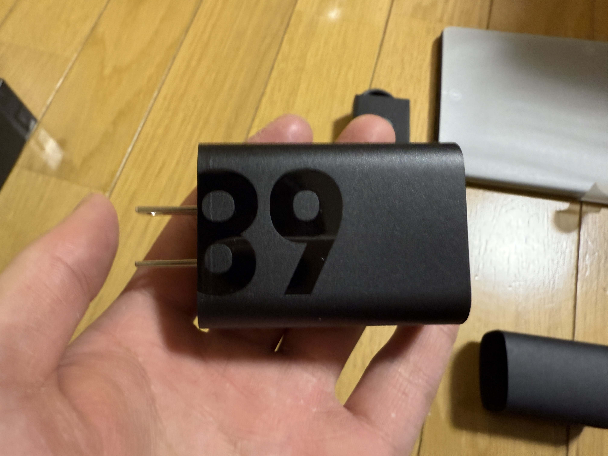

どうもharukinです。

今回は、Lenovoの新しいタブレット、Lenovo Legion Tab (8.8”, 3)を購入しましたので、そのレビューをしていきます。

:::note
この端末を買ったのは2月ぐらい、確か記事を書き始めたのは3月とかそこぐらいだったのですが、なんだかんだダラダラしてしまったため凄く今更の記事になってしまいました。なお、記事を書き始めた当時からそこそこ[情勢の変化](./#7-追記)が起きておりだいぶ記事の品質に問題アリではある気がしますが今更校正する体力も余りないのでこのまま公開します。ごめんなさい！
:::

## 0. はじめに

まず大前提として、自分の触れる世界に先代のLegion Y700(初代、日本未発売モデル)とその次、Legion Y700 2023(の日本版、NEC LAVIE Tab T9)が手元、というよりは同居人の手持ちとしてあります。このLegion Tabの購入もそれにかなり影響を受けて決定したものとなります。日本にLenovoブランドで出してきてくれて、うれしいね！

## 1. Legion Tab (8.8”, 3)とは

Legion TabはLenovoのゲーミング系タブレットシリーズで、その中でも今回は8.8インチのモデルを買ったという感じになっています。先に触れたとおり、またOneMix5の記事でも書いたとおり、 __小型こそ正義__ という信念を持っている私にとっては、このサイズは非常に魅力的でした。当時から欲しいなとは思ってましたが、優先順位が特別高いというわけではないのと同居人が応援購入してくれていたのでスルーしていました。特筆すべきはやはりそのスペック、8インチでありながらSnapdragon 8Gen3を積んでいるという点。こういう小型タブレットで高性能なものってなかなかないので、なんとか日本上陸してくれないかなとは思い続けていたんですが3年の時を経て遂に日本上陸！！今回こそ応援の意味もあって購入をしました。やはりこの時代に大型化するタブレット市場、非常に非常に私は興味を持てなくて、やはりこの8インチサイズは魅力的なんですよ。まぁ、iPadOSであれば同種のiPadMiniという選択肢もありますしあれもいつか買いたいなとは思っていますがやはり私はAndroidがいいので...(後にその判断は合っていたというか、用途的にiPadを選んでいると詰んでいるかもしれないと思うことになります)

## 2. スペック表：

| 項目             | スペック                                          |
| ---------------- | ------------------------------------------------- |
| SoC              | Snapdragon 8Gen3                                  |
| RAM              | 12GB LPDDR5X                                      |
| ストレージ       | 256GB UFS 4.0                                     |
| ディスプレイ     | 8.8インチ 2560x1600 16:10 500 nit, 165Hz          |
| インターフェース | TypeC(alt対応USB3.1x1, alt非対応USB2.0x1) 計2箇所 |
| 通信             | Wi-Fi 7, Bluetooth 5.4                            |
| バッテリー       | 6500mAh                                           |
| 充電             | 最大65W TypeC                                     |
| サイズ           | 約 208.5x129.5x7.8mm                              |
| OS               | Android 14(15アップデート来ました！)              |
| 重量             | 350g                                              |
| 価格             | 79800円(日本Lenovo公式通販)                       |

## 3. 開封と外観

### 余りにもガバガバすぎる梱包

まずこれ見てよ...

え、こんなスッカスカの梱包で送ってきたの？マジ？めっちゃ箱ガタガタしてましたけど...ってか角潰れてたし...まぁ、中身は無事だったのでいいんですけどねw

んでテープとかをはがして本体のお出まし

### 付属品

これで全部です。本体、ケーブル、充電器、謎の紙だけですね。イヤホンジャック無いし、せめて変換ケーブルぐらいあってもいいような気もするが、まぁみんな持ってるか...(事実私も持っている)

充電器は89Wのものが付属！

しているわけではなく、68Wのものが付属していました。最速充電をするには独自の規格で殴る必要がありますがPDの65W、20V3.25Aで充電可能なのでほぼ最速な気も。PDで充電していくと思います。独自拡張として20V3.4A,11V6.2Aの二種類が増えています。

### 外観

下部に控えめなLenovo、中央に主張強めなLegionのロゴが入っています。サイズからすると控えめなカメラが二眼です。裸じゃないならほぼ問題ないであろう段差なので許容です。

一応Dolby Vision Atomosのロゴが入るようなスピーカー。ちゃんとステレオで音質も手持ちの中ではかなり良いほうですね。OneMix5ともいい勝負をしていると思う。というか、単純にスピーカーの品質で言えば全然勝てる。

## 4. 「タブレットとして」の使い勝手

まずこれを買うにあたって、「既にOneMix5があるのにどう使い分けるの？」と思うかもしれません。しかし杞憂です。UMPCとタブレットは共存共栄できます。ただ、最悪どっちかでなんとかすることもできなくはない、一緒に使えば更に便利になる、ぐらいの補完的立ち位置です(まぁ、そうでないと信者のみなさんがiPadとiPhoneとMacを買い漁る理由がわからなくなるので)。

### 基本性能を活かした単体としての使い方

<iframe title="プロセカ120fps録画テスト(3DMV編)" width="100%" height="100%" src="https://fedimovie.com/videos/embed/peZnTtnqWLp3mcWdew1RYb" frameborder="0" allowfullscreen="" sandbox="allow-same-origin allow-scripts allow-popups allow-forms" style="position: absolute; inset: 0px;"></iframe>

まず、基本的にSnapdragon 8Gen3を積んでいるので現代のスマホで動くゲームは快適に、しかもSoCの相性とかも問題無く安定してゲームができます。とはいえ、メインでやってるゲームなんてプロセカぐらいですけど、「プロセカを友達と画面共有しながら120fpsでコマ落ちせずマルチプレイ」なんてことを単体でこなせる余裕の性能は初めてですね。これまでの性能の最上位はiPhone16ProかZenfone10(Snapdragon 8Gen2)で、そちらでは120fps張り付きプレイまではいけるものの画面共有は厳しいかなって感じだったのでまた一つの大台を超えた感じがします。それと、8インチ級なので遂にプロセカで多運指運用ができるようになったので今絶賛練習中です。ちょっとずつAppendもクリアできるようになりたいなぁ。流石に等倍解像度120fps張り付き録画は無理そうですが、まぁヨシとしましょう。

<iframe title="PojavLauncherでAndroidタブレットでPCマイクラの夢を見る" width="100%" height="100%" src="https://fedimovie.com/videos/embed/wZ31gGpidMjLf6vzt6WHXy" frameborder="0" allowfullscreen="" sandbox="allow-same-origin allow-scripts allow-popups allow-forms" style="position: absolute; inset: 0px;"></iframe>

また、pojavLauncherというアプリがありまして、これ実はPC版のMinecraft(Java版)をJVMを用意したうえでアプリ上で動かしてしまう変わり種のアプリなんですよね。これがまぁ安定して快適に動くのなんの。OneMix5よりも快適に動くって言ってしまってもいいぐらいで、正直ショッキングでした。今時のArmの性能ってここまで来てるんだなぁって感じです。これで、Minecraftをタブレットで持ち運びながら遊ぶことができるので、これはこれで楽しいですね。明らかにMinecraftをパソコンでやろうと思わなくなっちゃいました。これでええやん全然。

:::tip
ただ、小さいこともあって排熱が若干厳しい感は否めなく、プロセカや学マスを長時間プレイしていると40度越えになってちょっとずつサーマルスロットリング的な挙動をしているなっていうのが見て取れます。私のようなソシャゲ細切れプレイ勢には問題ないけれど、腰を据えて長時間プレイするような人には持久力は無いかもしれないです。
:::

### メディアプレーヤーとしての価値

<blockquote class="twitter-tweet" data-media-max-width="1024">
OneMix5を音質が良くなったと購入当初は思っていたが、あれからiPhone16ProとLegion Tabが参入したので最近よく聴くアンチユーでも流してみようか。俺の手持ちで今一番音が良いのはLegionだと答える。 OneMix5もHarmanKardonでかなり良くなってるが、それをも上回ってくるね。LegionはDolbyAtomos。 <a href="https://t.co/4pt8RdK3M7">pic.twitter.com/4pt8RdK3M7</a>
&mdash; Hairs UK Intelligent٩(✿ &#39; ᴗ &#39; )۶ (@mhkai00731) <a href="https://twitter.com/mhkai00731/status/1897658807213547991?ref_src=twsrc%5Etfw">March 6, 2025</a></blockquote> 
<blockquote class="twitter-tweet" data-media-max-width="1024">
音楽が違うのは不公平感あったので同じ曲を流してみよう。ロミシンだとだいぶ大差ないような気もしてきた。Legionのそれは何かのタイミングでぶっささる良さがあるように感じるね。OneMix5はパソコンの割には上等だが、やはり癖もないが常に7割8割いい音出してくれるiPhone、レベル高いなぁと思う。 <a href="https://t.co/sIudAZ2Cam">pic.twitter.com/sIudAZ2Cam</a>
&mdash; Hairs UK Intelligent٩(✿ &#39; ᴗ &#39; )۶ (@mhkai00731) <a href="https://twitter.com/mhkai00731/status/1897663778025869456?ref_src=twsrc%5Etfw">March 6, 2025</a></blockquote> 
OneMixをレビューしたときも音質の進化には驚きましたが、流石タブレットというだけあってメディア用途は考慮されているらしく相当に煮詰められてます。

それこそ、オーディオって方向だったらiPadMiniが強くなっちゃうんでしょうけどそれはそれとして手持ち最上位ランクに割り込んできました。これは強い。

実際、このLegionを持って実家に行ったときにqobuzのストリーミングでクラシックの楽曲を流していたら親に「どこからこんな音が？」と驚かれました。やはり音量の大きさとその音質の良さは段違いなようで、以外なところからかなりの高評価を得ることになって正直驚いています。

また特にYoutubeになるとWindowsだとアプリが無くブラウザベースになったりちょっと扱いにくい側面はあるのでAndroid上で見た方が快適なのはそうなのですが、元々そういう理屈でYoutube自体スマホの5インチ6インチぐらいの画面を固定してたので画面がデカすぎてちょっと困っています。なのでスクリーンショットみたいくマルチウインドウモードを使って画面だけ小さく切り出してTwitterやChromeを動かしたりしています。正直Youtubeぐらいで8インチは大きすぎかなぁ...

基本的にメディアとしてはスマホで撮影された動画を転送して仕事相手に見せたりだとか、Youtube,YoutubeMusic,Qobuz,AmazonPrimeVideoの遊びだとか、それぐらいの使い方になっていますね。

## 5. 「相棒として」の使い勝手

手元がOneMix5があるので、これの補完的に使えないかと思っていたわけですが目論見通りの使い方をできて満足しています。LenovoのタブレットにはSmartConnectという連携アプリがあり、これでWindowsと連携させると色々と便利に使えます。通信にはWifiか、USB接続が行けるのですが想定外だったのは短辺側のUSB2.0のポートに接続しても安定して動いているというところ。どっちのポート刺しても使えるのはスタンドに立て掛けて使うときに邪魔にならなくていいんだけれども、このSmartConnectの実態はUSB2.0の規格内で通信してるだけなのか。結構力業だなぁ～って感じですが、それでも使い勝手は悪くないです。まぁよくよく考えたらUSB2.0の速度だって480Mbpsだから十分なんだよな。
### OneMixの画面拡張として、OneMixをタブレットの拡張として

まず一番使用頻度が高めなツールが「クロスコントロール」です。これは接続済みのデバイスを相互コントロールできる機能になります。機能としては大きく二つあり、**パソコンの画面を拡張する**か、**タブレットをパソコンから操作する**かになります。

#### 1. パソコンの画面を拡張

ご覧の通りです。パソコンの画面を単純に拡張できます。単純にWindowsの画面を拡張して、タブレットをサブモニターとして運用できます。

どれぐらい遅延があるのかがが気になると思いますが、wifi、手元のテザリング(Zenfone10)、でこんな感じ↓

<blockquote class="twitter-tweet" data-media-max-width="1024">
Legionへのワイヤレス画面拡張の遅延など。 時々引っかかる時はあるんだけど、割と実用的。 <a href="https://t.co/7AEcPIClob">pic.twitter.com/7AEcPIClob</a>
&mdash; Hairs UK Intelligent٩(✿ &#39; ᴗ &#39; )۶ (@mhkai00731) <a href="https://twitter.com/mhkai00731/status/1929064418500853839?ref_src=twsrc%5Etfw">June 1, 2025</a></blockquote>  

まぁ遅延はあるにはあるが許容範囲って感じ。勿論、ゲームができるような代物ではないですが独立したモニターとして相手に資料を見せるとか、そういう程度なら全然許容範囲。画面もタッチできるし、ただのモバイルモニターより軽くて電池もあるし、小さくて取り回しもいいし、ケーブル不要だし、色々便利ポイントは大きいです。

#### 2. タブレットをパソコンから操作
.gif)
これはちょっと分かりにくいかもしれませんが、タブレットの画面にパソコンのマウスとキーボードが接続されるようなモードです。タブレットをメディア枠等としてパソコンのサブとして設置しているときにわざわざタブレットに触らなきゃいけないシーンが発生したときにそのマウスから手を放さず操作できます。地味なんですが、動画再生を制御したりだとか、そこにマウスを持っていくとキーボードでタブレットの音量が調整できるなど地味に痒い所に手が届くツールになってます。なんならソーシャル系をPCブラウザからタブレットアプリに移動させて、そこにマウスを送ってキーボードで入力するなんてパソコンの性能を割くような使い方もできます。トリッキー。

#### 3. OneMixにLegionのアプリを表示
.gif)

これも一部のメーカーのタブレットでは時々よく見るようになった、パソコンへのアプリのストリーミング機能。
これはあまり使うことは無いのですが、地味にアプリを複数展開したいときに役立ちます。本当に、地味に、役に立つのよねこれが。

### ZUIのカスタマイズによる使い勝手

SmartConnectを抜きにしてもそもそもZUIがアプリを複数起動させることに向いているOS設計となっているのでなんだかかんだ三枚ぐらい表示させるシーンが多いです。
普段は左にOutlook, 小窓でメールから届いた資料をPDFビューワーとか、中ぐらいで右にTeamsのチャット画面を表示、みたいな感じでそこから更にアプリが追加で立ち上がったり消えていったりしています。小さい画面の中でも意外にマルチタスが扱いやすい。まぁ、流石に並列表示させるわけではないんですがねw

概念上はウィンドウは5枚まで開けるんですが、流石に狭いですね。ウィンドウは、と明示するのは一番下のレイヤーで更によくある画面分割で二枚なので同時に7つのアプリを実行することができるのです。更に上記のパソコンへのアプリのストリーミングを使えば5枚、つまりPCで5、タブレットで5+2、合計12枚のアプリを同時にアクティブにすることができます。なんで動くんだよ。どうなってんだよお前。

また、この上部にあるような「共有ハブ」というのがありまして、まぁ簡単に言ったらデバイスを跨いで一時的にプールできる仮想エリアって感じです。データとしては必要だが、わざわざ明示的に転送するほどではない(一時的に取り込んですぐ削除する)ようなタイミングで使うと地味に効いてくるんですよね。複数ファイル、しかもクリップボードとかもなんでも放り込んで思い出したときに取り出せるんです。あ、因みに普通にクリップボード共有も勿論ありますよ。パソコンでコピーしてタブレットでペーストするとかはよくやります。

#### っていうか...なんでパソコンのシステムファイルがタブレットでリアルタイムに見れてるんですかねぇ...(困惑)

 
`C:/Windows`が普通に見れるAndroidタブレットis何????
逆もまた然りなんだけど、普通に内部ストレージかのように表示してやがる...これどうやってんだろうwとんでもなく便利なんだけど恐ろしいことをしているような気がするw

## 6. まとめ
というわけで、Lenovo Legion Tab (8.8”, 3)のレビューでした。正直、タブレットとしての使い勝手は非常に良く、特にメディアプレーヤーとゲーム端末としての性能は素晴らしいです。また、OneMix5との連携も非常にスムーズで、タブレットとUMPCの融合、使い分けができるのは大きな利点です。

最初にiPadは選ばない判断が正しかった、と書いてますが、既にiPhoneを持っていながらその扱いに難儀しているという部分が大きくあります。ファイル共有に難があるだけでなくそもそも規格が独自なものが多くデータのやり取り、共通運用が難しく外にも出しにくいデータを吐き出されても...等様々な理由でiOSに対してストレスがあるんですよね。しかも画面の拡張としては使えない。OneMixの助手としてタブレットを探しているのにmac以外との連携をする気が無ければ単体でもさしてマルチウインドウを使いこなせない。色々不満点がある中で、そもそも使いこなせるのだろうか...と不安を持ちながらLegionを買いましたが想像以上にOSのカスタム内容が濃くてかなり満足して使いこなせています。ただの板じゃダメなのだよ。ただの板じゃ。

もし、8インチのハイエンドタブレットを探している方がいれば、Lenovo Legion Tab (8.8”, 3)は非常におすすめです。特に、Snapdragon 8Gen3の性能を活かしたゲームやメディアプレーヤーとしての使い方は、他の8インチ級ではRedmagicぐらいかな？まぁ、もうこれからは8 elite版が出てくるのでそちらを待つのも全然アリですが、如何せんこのサイズのタブレットは取り扱いもしやすくかなりおススメです。皆さんも買ってみません???クッソデカいタブレットより小回り効きますよ!!!(圧)

## 7. 追記
記述し始めた当時からすると、ずいぶんと最近は8インチタブがローエンド、ハイエンド含め選択肢が増えてきてとても見ていて楽しいですね。Redmagicは一番近しい存在ですし、ミッドハイ程度でも充分なのでAlldocubeからも怒涛の勢いでリリースされていて良いぞ～～～♡って思いながら見てます。
### 業務情報専用に用意されたiPad Mini
実はこれを書いている間に、業務の情報専用にiPadMiniが渡されました。ちょっと古い5世代、かな。折角なのでここに比較画像を置いておきます。

こう見ると、ちょっとだけiPadMiniより大きいんですねぇ。ベゼルの数だけiPadMiniの方が更にディスプレイが小さいので情報量にはそこそこの差がありますが、私はこのベゼルがあってボタンがあってのデザインも嫌いじゃないっていうか、物理だからよかったのにな～～って悲しみに暮れています。っていうか、iPadMini、大体ケース付けるから忘れがちだけど薄いね！こういうハードウェアのクオリティは好きなんだよな。あ、Lightningは嫌いです。こいつのためにケーブルを一本まだ保守してる。